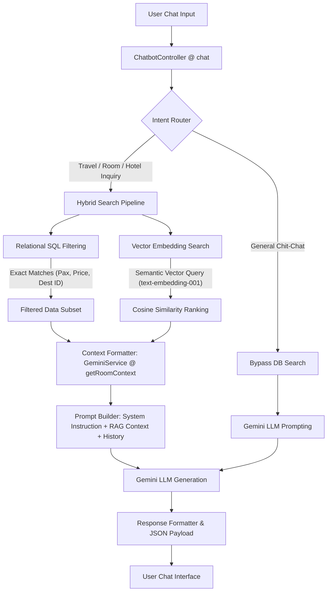
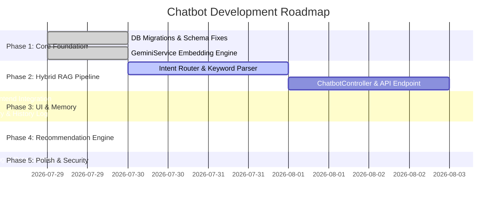

# SunnyTrips AI Chatbot & Recommendation System — Architectural & Development Guide

> **Document Status**: Production Specification (Single Source of Truth)  
> **Target Framework**: Laravel 13.x + PostgreSQL/pgvector or MySQL + Gemini 1.5/2.0 API (`text-embedding-001` / `gemini 2.5 flash-lite`)  
> **Architecture Pattern**: Hybrid Retrieval-Augmented Generation (Intent Routing + Vector Similarity Search + SQL Relational Filtering + LLM Synthesis)

---

## Table of Contents

1. [Project Overview](#1-project-overview)
2. [System Architecture](#2-system-architecture)
3. [Hybrid Retrieval Strategy](#3-hybrid-retrieval-strategy)
4. [Knowledge Sources & Data Mapping](#4-knowledge-sources--data-mapping)
5. [Embedding Strategy & Pipeline](#5-embedding-strategy--pipeline)
6. [Recommendation System Engine](#6-recommendation-system-engine)
7. [Conversation Memory & State Management](#7-conversation-memory--state-management)
8. [Responsibility Matrix (Laravel vs Gemini)](#8-responsibility-matrix-laravel-vs-gemini)
9. [Laravel System Structure](#9-laravel-system-structure)
10. [API Specification & Data Contracts](#10-api-specification--data-contracts)
11. [Development Roadmap & Phases](#11-development-roadmap--phases)
12. [Best Practices, Caching & Performance](#12-best-practices-caching--performance)
13. [Future Enhancements](#13-future-enhancements)

---

## 1. Project Overview

### 1.1 Purpose

The **SunnyTrips AI Chatbot** is a hyper-personalized, intelligent travel assistant and recommendation engine built into the SunnyTrips platform. It assists travelers in discovering destinations, hotels, room types, activities, and dining options across the Philippines, providing instant, factual, and context-aware responses.

### 1.2 Primary Goals

1. **Zero Hallucination Factual RAG**: Ensure all pricing, room policies, amenities, and hotel details are strictly sourced from the active database via vector similarity retrieval.
2. **Context-Aware Recommendations**: Match user preferences (ideal guest profile, budget, group size/pax, desired vibes) with relevant rooms, hotels, and activities.
3. **Intent-Driven Hybrid Architecture**: Intelligently route queries so conversational greetings bypass database searches while complex travel queries execute vector and relational queries.
4. **Sub-Second Latency & Cost Efficiency**: Optimize vector searches and prompt lengths to minimize token costs and deliver fast response times.

### 1.3 Scope of the System

- **Included**: Destination inquiries, hotel discovery, room type matching, pricing/pax calculations, amenity filtering, activity recommendations, and policy retrieval.
- **Excluded (Phase 1)**: Direct payment processing, real-time third-party flight booking integrations.

---

## 2. System Architecture

### 2.1 Hybrid Retrieval Architecture Diagram



### 2.2 End-to-End Query Execution Steps

1. **Client Request**: User submits a natural-language query (e.g., _"Find a beachfront room in Boracay for 4 pax under ₱6,000 with extra bed options"_).
2. **Session & Memory Resolution**: `ChatbotController` resolves `conversation_id`, retrieves past $N$ messages from database/Redis.
3. **Intent Classification & Extraction**:
    - `IntentRouter` parses keywords and regex (extracts pax count, budget ceiling, destination name).
    - Classifies query as `ROOM_SEARCH`, `HOTEL_SEARCH`, `ACTIVITY_SEARCH`, or `GENERAL_TALK`.
4. **Hybrid Retrieval Execution**:
    - For `ROOM_SEARCH`: Calls `GeminiService::searchRooms($userQuery, $limit)`.
    - Generates vector via Gemini `text-embedding-001`.
    - Executes Cosine Similarity against `rooms.embedding` combined with eager-loaded `hotel` and `destination` relationships.
5. **RAG Context Formatting**:
    - `GeminiService::getRoomContext($scoredRooms)` compiles candidate rooms into structured markdown blocks containing room name, hotel name, ideal guest, occupancy, base rate, amenities, and additional notes.
6. **Prompt Assembly & LLM Synthesis**:
    - Constructs system instruction with strict grounding rules ("Answer ONLY using the provided database results").
    - Sends payload to `gemini-1.5-flash`.
7. **Response & Audit**:
    - Saves interaction to `chat_messages` table.
    - Returns structured JSON response to frontend widget.

---

## 3. Hybrid Retrieval Strategy

### 3.1 Retrieval Decision Matrix

| Query Type                          | Primary Method                | Secondary Fallback     | Decision Condition                                                |
| ----------------------------------- | ----------------------------- | ---------------------- | ----------------------------------------------------------------- |
| **General Greeting / Out of Scope** | Direct Gemini LLM             | N/A                    | No travel/hotel keywords detected                                 |
| **Specific Room Search**            | Semantic Vector Search        | Keyword ILIKE          | User mentions room features, views, vibes, or ideal guest         |
| **Exact Price / Pax Filtering**     | SQL Relational Query          | Vector Search          | Query contains explicit numeric constraints (`<= ₱5000`, `4 pax`) |
| **Hybrid Room Match**               | SQL Filter + Vector Rank      | Cosine Similarity      | Query combines destination + max budget + specific features       |
| **Hotel Recommendation**            | Cosine Similarity on `hotels` | Popularity / Rate Rank | User asks for top hotels in a destination                         |

### 3.2 Decision Logic Pipeline

```php
// Step 1: Detect intent
if (!$intentRouter->isTravelQuery($userQuery)) {
    return $geminiService->generateResponse($generalPrompt, $userQuery);
}

// Step 2: Extract explicit constraints
$constraints = $intentRouter->extractConstraints($userQuery); // pax, max_price, destination_id

// Step 3: Perform Hybrid Retrieval
$scoredRooms = $geminiService->searchRoomsHybrid($userQuery, $constraints, $limit = 5);

// Step 4: Inject Context & Synthesize
$contextText = $geminiService->getRoomContext($scoredRooms);
return $geminiService->generateGroundedResponse($systemInstruction, $contextText, $userQuery);
```

---

## 4. Knowledge Sources & Data Mapping

| Entity           | Primary Table  | Key Vector-Embedded Attributes                                                                                                               | Relational Filter Fields                             |
| ---------------- | -------------- | -------------------------------------------------------------------------------------------------------------------------------------------- | ---------------------------------------------------- |
| **Hotels**       | `hotels`       | `hotel_name`, `vibe_tags`, `featured_amenities`, `hotel_description`, `specific_address`                                                     | `destination_id`, `type`, `id`                       |
| **Rooms**        | `rooms`        | `room_name`, `ideal_guest`, `occupancy`, `bed_configuration`, `room_size`, `base_price`, `room_amenities`, `additional_notes`, `description` | `hotel_id`, `base_price`, `occupancy`, `total_rooms` |
| **Destinations** | `destinations` | `name`, `description`, `highlights`                                                                                                          | `id`, `name`                                         |
| **Activities**   | `activities`   | `title`, `ideal_for`, `description`, `location`                                                                                              | `destination_id`, `price`                            |

---

## 5. Embedding Strategy & Pipeline

### 5.1 Embedding Specifications

- **Embedding Model**: `models/text-embedding-001` (Gemini API)
- **Vector Dimension**: 768 / 3072 dimensions (L2 Normalized)
- **Task Types**:
    - `RETRIEVAL_DOCUMENT`: Used when storing/updating records in DB.
    - `RETRIEVAL_QUERY`: Used when encoding user chat queries.

### 5.2 Room Embedding Template (`buildRoomEmbeddingText`)

To maximize semantic search accuracy, every room is converted into a standardized text block before embedding:

```text
Hotel Name: {hotel_name}
Room Name: {room_name}
Destination: {destination_name}
Ideal Guest: {ideal_guest}
Occupancy: {occupancy} guests maximum
Bed Layout: {bed_configuration}
Room Dimensions: {room_size}
Base Price: ₱{base_price} per night
Room Amenities: {room_amenities_list}
Additional Notes & Policies: {additional_notes}
Room View: {view_type}
Inventory Capacity: {total_rooms} total rooms available
Detailed Room Description: {description}
```

### 5.3 Auto-Reindexing Pipeline

Whenever a room or hotel is created or updated in the Admin Portal, `RoomController` / `HotelController` automatically triggers re-embedding:

```php
$embeddingText = $geminiService->buildRoomEmbeddingText($room, $hotel->hotel_name, $destinationName);
$vector = $geminiService->generateEmbedding($embeddingText, 'RETRIEVAL_DOCUMENT', $room->room_name);

if ($vector) {
    $room->embedding = $geminiService->formatVectorForDb($vector);
    $room->save();
}
```

---

## 6. Recommendation System Engine

### 6.1 User Preference Vector Scoring

Recommendations evaluate a user's preference vector $\vec{U}$ against candidate room vectors $\vec{R}_i$ using Cosine Similarity:

$$\text{Similarity}(\vec{U}, \vec{R}_i) = \frac{\vec{U} \cdot \vec{R}_i}{\|\vec{U}\| \|\vec{R}_i\|}$$

### 6.2 Multi-Factor Ranking Formula

Final Recommendation Score ($S$) combines vector similarity with hard constraints:

$$S = w_1 \cdot \text{VectorSimilarity} + w_2 \cdot \text{IdealGuestMatch} + w_3 \cdot \text{BudgetFitness}$$

Where:

- $w_1 = 0.50$ (Semantic match to user's desired vibe/perks)
- $w_2 = 0.30$ (Exact match between room `ideal_guest` and user profile)
- $w_3 = 0.20$ (Proximity of `base_price` to target budget)

---

## 7. Conversation Memory & State Management

### 7.1 Database Schema (`chat_sessions` & `chat_messages`)

```sql
CREATE TABLE chat_sessions (
    id BIGINT PRIMARY KEY AUTO_INCREMENT,
    session_token VARCHAR(255) UNIQUE NOT NULL,
    user_id BIGINT NULL,
    metadata JSON NULL,
    created_at TIMESTAMP DEFAULT CURRENT_TIMESTAMP
);

CREATE TABLE chat_messages (
    id BIGINT PRIMARY KEY AUTO_INCREMENT,
    chat_session_id BIGINT FOREIGN KEY REFERENCES chat_sessions(id) ON DELETE CASCADE,
    sender ENUM('user', 'bot') NOT NULL,
    message TEXT NOT NULL,
    context_data JSON NULL,
    created_at TIMESTAMP DEFAULT CURRENT_TIMESTAMP
);
```

### 7.2 Context Windowing & Multi-Turn Retention

- Maintain the last **6 dialogue turns** (12 messages) in active prompt context.
- Summarize older turns into a compact `conversation_summary` string if dialogue exceeds 10 turns.

---

## 8. Responsibility Matrix (Laravel vs Gemini)

| Subsystem / Task                         | Handled By         | Implementation Location                  |
| ---------------------------------------- | ------------------ | ---------------------------------------- |
| **Query Routing & Intent Detection**     | Laravel PHP        | `App\Services\Chat\IntentRouter`         |
| **Vector Embedding Generation**          | Gemini API         | `GeminiService::generateEmbedding()`     |
| **Cosine Similarity Ranking**            | Laravel / DB       | `GeminiService::rankRecommendations()`   |
| **SQL Hard Constraint Filtering**        | Laravel Eloquent   | `RoomType::where(...)`                   |
| **RAG Context Text Assembly**            | Laravel PHP        | `GeminiService::getRoomContext()`        |
| **Natural Language Response Generation** | Gemini LLM         | `gemini-1.5-flash` API                   |
| **Session Memory & Persistence**         | Laravel DB / Redis | `ChatbotController` & `ChatSessionModel` |

---

## 9. Laravel System Structure

```
app/
├── Http/
│   └── Controllers/
│       └── Api/
│           └── ChatbotController.php      # Main API Endpoint Controller
├── Models/
│   ├── HotelModel.php                      # Hotel Entity
│   ├── RoomType.php                        # Room Entity (Ideal Guest & Notes)
│   ├── DestinationModel.php               # Destination Entity
│   ├── ChatSession.php                     # Chat Session State
│   └── ChatMessage.php                     # Message Log
└── Services/
    ├── GeminiService.php                   # Core Vector Search & Embedding Engine
    └── Chat/
        ├── IntentRouter.php                # Intent & Constraint Parser
        └── ConversationManager.php         # Memory & Context Truncation
```

---

## 10. API Specification & Data Contracts

### 10.1 Chat Endpoint

- **URL**: `POST /api/v1/chat`
- **Headers**: `Content-Type: application/json`, `Accept: application/json`

#### Request Payload:

```json
{
    "session_token": "sess_abc123xyz",
    "message": "Can you recommend a romantic room in Boracay under 5000 pesos for 2 guests?"
}
```

#### Response Payload:

```json
{
    "status": "success",
    "session_token": "sess_abc123xyz",
    "reply": "Here is a wonderful option for your romantic trip to Boracay...",
    "retrieved_rooms": [
        {
            "id": 12,
            "room_name": "Deluxe Sunset Ocean Suite",
            "hotel_name": "Paradise Bay Resort",
            "base_price": 4500.0,
            "ideal_guest": "Couples, Honeymooners",
            "similarity_score": 0.8942
        }
    ]
}
```

---

## 11. Development Roadmap & Phases



---

## 12. Best Practices, Caching & Performance

1. **Cache Common RAG Embeddings**: Store query vectors for frequent queries in Redis (`Cache::remember('embed_' . md5($query), 86400, ...)`).
2. **System Prompt Grounding**: Always enforce strict system instructions to prevent LLM hallucinations:
    > _"If the answer cannot be verified using the provided database results, politely inform the user that information is unavailable."_
3. **Database Indexing**: Ensure indexes exist on `hotel_id`, `base_price`, and `occupancy` in the `rooms` table.
4. **Token Cost Optimization**: Limit context to Top 3–5 scored records ($N=5$) to keep token counts small and API execution fast.

---

## 13. Future Enhancements

- **Voice Assistant Interface**: Speech-to-text input via Web Speech API.
- **Interactive Map Pinning**: Dynamic map marker highlighting when a user selects a recommended hotel.
- **Booking Flow Handoff**: One-click pre-populated booking checkout directly from chatbot room cards.
- **Multi-Language Support**: Seamless Tagalog / English (Taglish) RAG translation.
