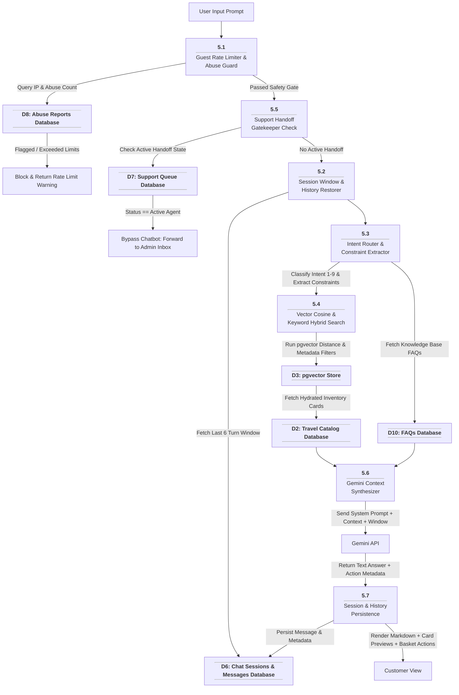
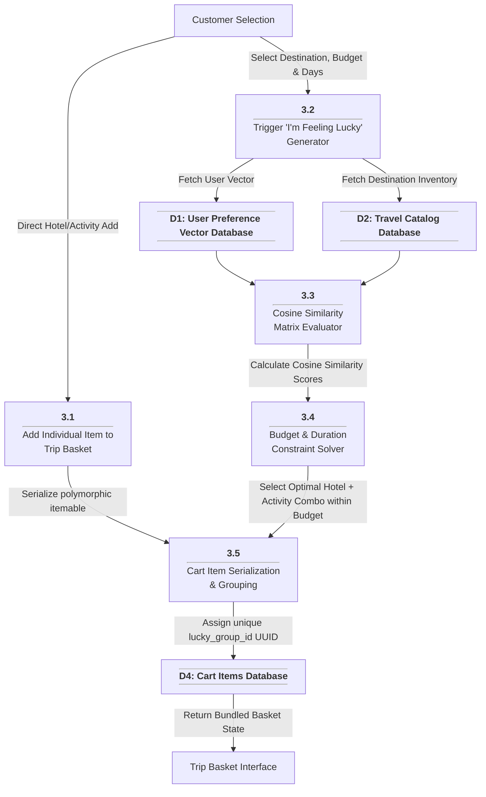

# SunnyTrips Capstone V2 — Complete ERD & DFD Documentation

**System:** SunnyTrips Philippine Travel Booking Platform with AI Decision Support System (DSS)  
**Stack:** Laravel 13, PHP 8.3, Blade + Alpine.js + Tailwind CSS + Vite, PostgreSQL + pgvector (`vector(3072)`), Google Gemini API (`text-embedding-001` / Gemini models)  
**DFD Standard:** Gane & Sarson Standard Notation

---

## 1. System Overview

SunnyTrips Capstone V2 is an intelligent travel booking platform designed specifically for Philippine tourism destinations. It integrates standard e-commerce travel booking functionality (hotels, rooms, activities, add-ons, bundled packages, shopping cart/trip basket, and checkout) with an advanced **AI Decision Support System (DSS)** powered by **pgvector** cosine similarity embeddings and Google Gemini API.

Key Subsystems:
1. **User Onboarding & Vector Preference System**: Captures user trip preferences and computes an aggregate cosine preference vector (`users.preferences_embedding`).
2. **Hybrid RAG Chatbot & 9-Intent Router**: Features 9 specialized intent routes, constraint extraction, pgvector hybrid vector/keyword search, abuse detection, and guest fallback tokens.
3. **"I'm Feeling Lucky" Custom Itinerary Generator**: Automated package bundling matching destination, duration, budget, and vector similarity score.
4. **Booking Engine, Guest Manifest, Stripe Payment & Expiry Engine**: Handles guest manifests, Stripe checkout sessions & webhooks (`PaymentWebhookController`), passenger age rules, admin price adjustments, and `BookingExpiryService` cron sweeps.
5. **Live Human Support Queue**: Atomic ticket claiming for admins with a state machine gatekeeper overriding AI chatbot responses when active support is triggered.
6. **Polymorphic Review System**: Item-level reviews and automated background summary aggregations for travel inventory items.

---

## 2. Entity Relationship Diagram (ERD)

### 2.1 Visual ERD (Mermaid)

```mermaid
erDiagram

    %% --- CORE USER & SECURITY ---
    USERS {
        bigint id PK
        string name
        string email
        string password
        string role
        vector_3072 preferences_embedding
        timestamp onboarding_completed_at
        boolean data_privacy_consent
        timestamp terms_accepted_at
        integer ban_level
        timestamp banned_until
        text ban_reason
        timestamps created_at_updated_at
    }

    ADMINS {
        bigint id PK
        string name
        string email
        string password
        string role
        timestamps created_at_updated_at
    }

    CHATBOT_ABUSE_REPORTS {
        bigint id PK
        bigint user_id FK
        string ip_address
        string reason
        string severity
        timestamp blocked_until
        timestamps created_at_updated_at
    }

    %% --- TRAVEL INVENTORY CATALOG ---
    DESTINATIONS {
        bigint id PK
        string name
        text description
        string region
        string island_group
        decimal latitude
        decimal longitude
        string image_path
        string vibe
        boolean is_shown
        timestamps created_at_updated_at
    }

    HOTELS {
        bigint id PK
        bigint destination_id FK
        string name
        text description
        string address
        decimal rating
        string vibe
        boolean is_shown
        json image_paths
        timestamps created_at_updated_at
    }

    ROOMS {
        bigint id PK
        bigint hotel_id FK
        string name
        text description
        integer capacity
        integer max_occupancy
        decimal price_per_night
        decimal extra_person_fee
        text additional_notes
        string ideal_guest
        vector_3072 embedding
        boolean is_shown
        json image_paths
        timestamps created_at_updated_at
    }

    ACTIVITIES {
        bigint id PK
        bigint destination_id FK
        string name
        text description
        decimal price
        string duration
        string category
        decimal latitude
        decimal longitude
        vector_3072 embedding
        boolean is_shown
        string image_path
        timestamps created_at_updated_at
    }

    ADD_ONS {
        bigint id PK
        string name
        text description
        decimal price
        string category
        vector_3072 embedding
        boolean is_shown
        string image_path
        timestamps created_at_updated_at
    }

    PACKAGES {
        bigint id PK
        bigint destination_id FK
        string title
        text description
        decimal base_price
        integer duration_days
        boolean is_customizable
        vector_3072 embedding
        boolean is_shown
        json image_paths
        timestamps created_at_updated_at
    }

    PACKAGE_HOTEL {
        bigint id PK
        bigint package_id FK
        bigint hotel_id FK
        bigint room_type_id FK
        integer nights
    }

    PACKAGE_ACTIVITY {
        bigint id PK
        bigint package_id FK
        bigint activity_id FK
        integer day_number
    }

    %% --- CART, BOOKINGS & WORKFLOW ---
    CART_ITEMS {
        bigint id PK
        bigint user_id FK
        string session_id
        string itemable_type
        bigint itemable_id
        date check_in_date
        date check_out_date
        integer quantity
        integer adults
        integer children
        decimal price
        string lucky_group_id
        json metadata
        timestamps created_at_updated_at
    }

    BOOKINGS {
        bigint id PK
        string booking_reference
        bigint user_id FK
        string guest_name
        string guest_email
        string guest_phone
        decimal total_amount
        decimal subtotal
        decimal discount
        decimal admin_price_adjustment
        string payment_status
        string booking_status
        json guest_manifest
        timestamps created_at_updated_at
    }

    BOOKING_ITEMS {
        bigint id PK
        bigint booking_id FK
        string itemable_type
        bigint itemable_id
        date check_in_date
        date check_out_date
        integer quantity
        decimal unit_price
        decimal total_price
        string availability_status
        json metadata
        timestamps created_at_updated_at
    }

    BOOKING_STATUS_HISTORIES {
        bigint id PK
        bigint booking_id FK
        string status
        text notes
        string updated_by_type
        bigint updated_by_id
        timestamps created_at_updated_at
    }

    PASSENGER_CATEGORY_RULES {
        bigint id PK
        string category_name
        integer min_age
        integer max_age
        decimal price_multiplier
        text description
        timestamps created_at_updated_at
    }

    %% --- CHATBOT & LIVE SUPPORT ---
    CHAT_SESSIONS {
        bigint id PK
        string session_token
        bigint user_id FK
        string status
        bigint assigned_admin_id FK
        timestamps created_at_updated_at
    }

    CHAT_MESSAGES {
        bigint id PK
        bigint chat_session_id FK
        string sender_type
        bigint sender_id
        text message
        json metadata
        timestamps created_at_updated_at
    }

    SUPPORT_INQUIRIES {
        bigint id PK
        bigint user_id FK
        bigint chat_session_id FK
        string session_token
        text issue_summary
        string status
        bigint assigned_admin_id FK
        timestamps created_at_updated_at
    }

    %% --- REVIEWS & RATING ENGINE ---
    REVIEWS {
        bigint id PK
        bigint user_id FK
        bigint booking_item_id FK
        string reviewable_type
        bigint reviewable_id
        integer rating
        string title
        text comment
        boolean is_featured
        boolean is_approved
        string reviewer_name
        timestamps created_at_updated_at
    }

    REVIEW_SUMMARIES {
        bigint id PK
        string reviewable_type
        bigint reviewable_id
        decimal average_rating
        integer total_reviews
        json rating_distribution
        timestamps created_at_updated_at
    }

    %% --- SYSTEM AUXILIARIES ---
    FAQS {
        bigint id PK
        string question
        text answer
        string category
        integer priority
        boolean is_active
        timestamps created_at_updated_at
    }

    WEATHER_CACHES {
        bigint id PK
        string location_key
        json weather_data
        decimal latitude
        decimal longitude
        timestamp fetched_at
        timestamp expires_at
        timestamps created_at_updated_at
    }

    LEGAL_DOCUMENTS {
        bigint id PK
        string type
        string title
        longtext content
        string version
        date effective_date
        timestamps created_at_updated_at
    }

    %% --- RELATIONSHIPS ---
    DESTINATIONS ||--o{ HOTELS : "contains"
    DESTINATIONS ||--o{ ACTIVITIES : "hosts"
    DESTINATIONS ||--o{ PACKAGES : "includes"
    HOTELS ||--o{ ROOMS : "offers"
    HOTELS ||--o{ PACKAGE_HOTEL : "included in package"
    ROOMS ||--o{ PACKAGE_HOTEL : "referenced in package"
    ACTIVITIES ||--o{ PACKAGE_ACTIVITY : "included in package"
    PACKAGES ||--o{ PACKAGE_HOTEL : "defines hotel options"
    PACKAGES ||--o{ PACKAGE_ACTIVITY : "defines activity itinerary"

    USERS ||--o{ CART_ITEMS : "adds to basket"
    USERS ||--o{ BOOKINGS : "places"
    USERS ||--o{ CHAT_SESSIONS : "owns"
    USERS ||--o{ SUPPORT_INQUIRIES : "submits"
    USERS ||--o{ CHATBOT_ABUSE_REPORTS : "flagged in"
    USERS ||--o{ REVIEWS : "writes"

    BOOKINGS ||--|{ BOOKING_ITEMS : "contains"
    BOOKINGS ||--o{ BOOKING_STATUS_HISTORIES : "tracks"
    BOOKING_ITEMS ||--o{ REVIEWS : "reviewed in"

    ADMINS ||--o{ CHAT_SESSIONS : "handles"
    ADMINS ||--o{ SUPPORT_INQUIRIES : "assigned to"

    CHAT_SESSIONS ||--|{ CHAT_MESSAGES : "contains"
    CHAT_SESSIONS ||--o| SUPPORT_INQUIRIES : "linked to"
```



---

### 2.2 Data Dictionary (Entity Definitions)

| Entity Name | Primary Key | Foreign Keys | Key Attributes & Description |
| :--- | :--- | :--- | :--- |
| **`users`** | `id` | None | System customers. Includes `preferences_embedding` vector(3072) generated from onboarding choices, ban levels, and terms consent. |
| **`admins`** | `id` | None | System administrators and support agents with elevated credentials. |
| **`destinations`** | `id` | None | Top-level tourist destinations (e.g. El Nido, Boracay, Siargao) with GPS coordinates and vibe tags. |
| **`hotels`** | `id` | `destination_id` | Accommodations within destinations. Has rating, address, and vibe details. |
| **`rooms`** | `id` | `hotel_id` | Specific room types. Contains capacity, extra person fee, and `embedding` vector(3072) for RAG matching. |
| **`activities`** | `id` | `destination_id` | Tours, water sports, and excursions. Contains GPS coordinates, price, and `embedding` vector(3072). |
| **`add_ons`** | `id` | None | Supplementary travel items (travel insurance, equipment rentals). Contains `embedding` vector(3072). |
| **`packages`** | `id` | `destination_id` | Bundled travel itineraries with base pricing, duration, and `embedding` vector(3072). |
| **`package_hotel`** | `id` | `package_id`, `hotel_id`, `room_type_id` | Pivot mapping hotels and default room types to pre-packaged bundles. |
| **`package_activity`** | `id` | `package_id`, `activity_id` | Pivot mapping itinerary activities to specific days in a package. |
| **`cart_items`** | `id` | `user_id` | Items in user basket or guest session. Uses polymorphic `itemable` fields and `lucky_group_id` for custom bundle grouping. |
| **`bookings`** | `id` | `user_id` | Top-level order record with reference code, totals, admin price adjustment, payment/booking status, and `guest_manifest` JSON. |
| **`booking_items`** | `id` | `booking_id` | Purchased items (rooms, activities, packages, add-ons). Uses polymorphic `itemable` references and availability flag. |
| **`booking_status_histories`** | `id` | `booking_id` | Audit trail for booking lifecycle transitions (Pending → Confirmed → Completed / Cancelled). |
| **`passenger_category_rules`** | `id` | None | Business rules defining price multipliers for Adults, Children, Infants, and Senior Citizens. |
| **`chat_sessions`** | `id` | `user_id`, `assigned_admin_id` | Conversations persistent across guest/logged-in states via localStorage session tokens. |
| **`chat_messages`** | `id` | `chat_session_id` | Individual chat messages sent by user, bot (Gemini), or human admin. |
| **`chatbot_abuse_reports`** | `id` | `user_id` | System log tracking spam/abuse violations and automated temp-bans. |
| **`support_inquiries`** | `id` | `user_id`, `chat_session_id`, `assigned_admin_id` | Support ticket queue for live human agent handoff claiming. |
| **`reviews`** | `id` | `user_id`, `booking_item_id` | Customer feedback on travel items using polymorphic `reviewable` columns. |
| **`review_summaries`** | `id` | None | Aggregated rating metrics per item calculated automatically. |
| **`faqs`** | `id` | None | Knowledge base questions and answers used for chat grounding and public FAQ page. |
| **`weather_caches`** | `id` | None | OpenWeather API responses cached by location coordinates with expiration window. |
| **`legal_documents`** | `id` | None | System Terms of Service and Privacy Policy versions. |

---

## 3. Data Flow Diagrams (DFD) — Gane & Sarson Visual Standard

---

### 3.1 DFD Level 0 — Context Diagram (Gane & Sarson)

```mermaid
flowchart TD
    %% EXTERNAL ENTITIES (Rectangles)
    Customer["Customer / Guest User"]
    Admin["Admin / Support Agent"]
    GeminiAPI["Google Gemini API<br/>(LLM & Embeddings)"]
    StripeAPI["Stripe Payment Gateway<br/>(Checkout & Webhooks)"]
    OpenWeatherAPI["OpenWeatherMap API"]
    SMTPMailer["SMTP Mail Server<br/>(Booking Notifications)"]

    %% SYSTEM BOUNDARY PROCESS (Split Header Box)
    SunnyTripsSystem["<b>0.0</b><hr style='margin:2px 0;'/>SunnyTrips Travel Booking &<br/>AI Decision Support System"]

    %% DATA FLOWS - CUSTOMER
    Customer -->|1. Auth, Preferences & Consent| SunnyTripsSystem
    Customer -->|2. Search & Basket Actions| SunnyTripsSystem
    Customer -->|3. Chat Prompts & Handoff Requests| SunnyTripsSystem
    Customer -->|4. Guest Manifest & Payment Submission| SunnyTripsSystem
    Customer -->|5. Ratings & Reviews| SunnyTripsSystem

    SunnyTripsSystem -->|A. Vector Matches & Recommendations| Customer
    SunnyTripsSystem -->|B. Hybrid Chat Responses & Action Cards| Customer
    SunnyTripsSystem -->|C. Cart Totals & Lucky Bundles| Customer
    SunnyTripsSystem -->|D. Booking Reference & Order Status| Customer

    %% DATA FLOWS - ADMIN
    Admin -->|6. Catalog & FAQ Edits| SunnyTripsSystem
    Admin -->|7. Claim Support Tickets & Agent Messages| SunnyTripsSystem
    Admin -->|8. Price Adjustments & User Moderation| SunnyTripsSystem

    SunnyTripsSystem -->|E. Admin Dashboard & Support Queue Stream| Admin

    %% DATA FLOWS - EXTERNAL SERVICES & PAYMENT
    SunnyTripsSystem -->|9. Text Content for Embedding| GeminiAPI
    GeminiAPI -->|H. 3072-dim Vectors & LLM Generation| SunnyTripsSystem

    SunnyTripsSystem -->|10. Create Checkout Session| StripeAPI
    StripeAPI -->|I. Webhook Events (charge.succeeded)| SunnyTripsSystem

    SunnyTripsSystem -->|11. Weather Forecast Query| OpenWeatherAPI
    OpenWeatherAPI -->|J. Forecast Data Payload| SunnyTripsSystem

    SunnyTripsSystem -->|12. Dispatch Booking Emails| SMTPMailer
```

---

### 3.2 DFD Level 1 — System Process Decomposition (Gane & Sarson Complete Architectural Flow Map)

```mermaid
flowchart TD
    %% EXTERNAL ENTITIES (Rectangles)
    User["Customer / Guest User"]
    AdminAgent["Admin / Support Agent"]
    Gemini["Google Gemini API"]
    Stripe["Stripe Payment Gateway"]
    OpenWeather["OpenWeatherMap API"]
    SMTP["SMTP Mail Server"]

    %% DATA STORES (Open-ended Parallel Lines)
    D1["<hr style='margin:0;'/><b>D1: Users & Preferences DB</b><hr style='margin:0;'/>"]
    D2["<hr style='margin:0;'/><b>D2: Travel Catalog Inventory DB</b><hr style='margin:0;'/>"]
    D3["<hr style='margin:0;'/><b>D3: Vector Embeddings Cache Store</b><hr style='margin:0;'/>"]
    D4["<hr style='margin:0;'/><b>D4: Cart Items & Lucky Bundles DB</b><hr style='margin:0;'/>"]
    D5["<hr style='margin:0;'/><b>D5: Bookings & Manifests DB</b><hr style='margin:0;'/>"]
    D6["<hr style='margin:0;'/><b>D6: Chat Sessions & Messages DB</b><hr style='margin:0;'/>"]
    D7["<hr style='margin:0;'/><b>D7: Support Queue Inquiries DB</b><hr style='margin:0;'/>"]
    D8["<hr style='margin:0;'/><b>D8: Abuse & Moderation Logs DB</b><hr style='margin:0;'/>"]
    D9["<hr style='margin:0;'/><b>D9: Reviews & Summaries DB</b><hr style='margin:0;'/>"]
    D10["<hr style='margin:0;'/><b>D10: FAQs & Legal Docs DB</b><hr style='margin:0;'/>"]
    D11["<hr style='margin:0;'/><b>D11: Weather Forecast Cache DB</b><hr style='margin:0;'/>"]

    %% PROCESSES (Split Header Boxes)
    P1["<b>1.0</b><hr style='margin:2px 0;'/>User Auth, Privacy &<br/>Vector Preference Onboarding"]
    P2["<b>2.0</b><hr style='margin:2px 0;'/>Travel Catalog RAG Embedding<br/>& Indexing Engine"]
    P3["<b>3.0</b><hr style='margin:2px 0;'/>Cart & 'I'm Feeling Lucky'<br/>Bundle Generator"]
    P4["<b>4.0</b><hr style='margin:2px 0;'/>Booking Engine, Manifest,<br/>Stripe Payment & Expiry Engine"]
    P5["<b>5.0</b><hr style='margin:2px 0;'/>Hybrid RAG AI Chatbot &<br/>9-Intent Router"]
    P6["<b>6.0</b><hr style='margin:2px 0;'/>Human Support Queue &<br/>Live Agent Handoff"]
    P7["<b>7.0</b><hr style='margin:2px 0;'/>Review Engine & Rating<br/>Aggregator"]
    P8["<b>8.0</b><hr style='margin:2px 0;'/>Admin Operations, Content<br/>Moderation & Price Adjustments"]

    %% --- USER & RETURN FLOWS ---
    User -->|1. Auth & Preferences| P1
    User -->|2. Basket / Lucky Request| P3
    User -->|3. Chat Prompts| P5
    User -->|4. Guest Manifest & Payment Info| P4
    User -->|5. Submit Item Reviews| P7

    P3 -->|Render Basket & Lucky Itineraries| User
    P4 -->|Return Booking Reference Code & Status| User
    P5 -->|Return Chat Answers & Action Cards| User
    P6 -->|Relay Support Agent Messages| User

    %% --- PROCESS 1.0 FLOWS ---
    P1 -->|Write User Profile & Preference Vector| D1
    P1 <-->|Generate 3072-dim Vector| Gemini

    %% --- PROCESS 2.0 CATALOG & VECTOR INDEXING FLOWS ---
    P8 -->|Trigger (Re)Embedding / Force Embed| P2
    P2 <-->|Generate Item Embeddings| Gemini
    P2 -->|Save Catalog Items| D2
    P2 -->|Store Item Vectors| D3

    %% --- PROCESS 3.0 CART & LUCKY GENERATOR FLOWS ---
    D1 -->|Read Preference Vector| P3
    D2 -->|Fetch Catalog Matches| P3
    D3 -->|Read Item Embeddings for Cosine Matrix| P3
    P3 -->|Write Cart Items & Lucky Group UUIDs| D4

    %% --- PROCESS 4.0 BOOKING, STRIPE & EXPIRY FLOWS ---
    D4 -->|Retrieve Cart Items & Prices| P4
    P4 -->|Create Booking, Items & Manifest (Pending)| D5
    P4 <-->|Create Checkout Session & Webhooks| Stripe
    P4 -->|Update Booking Status (Paid/Expired)| D5
    P4 -->|Dispatch Booking Emails| SMTP

    %% --- PROCESS 5.0 HYBRID CHATBOT PIPELINE FLOWS ---
    D8 -->|Check Abuse Count & Ban Status| P5
    D6 -->|Read 6-Turn Conversation Window| P5
    D2 -->|Fetch Catalog Cards| P5
    D3 -->|pgvector Cosine Search <=>| P5
    D10 -->|Read Knowledge Base FAQs| P5
    D11 -->|Read Weather Cache| P5
    P5 <-->|Fetch Fresh Weather (if D11 expired)| OpenWeather
    P5 -->|Update Weather Cache| D11
    P5 <-->|Send Prompt + Context, Get LLM Answer| Gemini
    P5 -->|Direct Add Card to Basket| D4
    P5 -->|Trigger Support Handoff| P6
    P5 -->|Persist Message & Metadata| D6

    %% --- PROCESS 6.0 SUPPORT QUEUE PIPELINE FLOWS ---
    P6 -->|Update Session Status = in_support| D6
    P6 -->|Enqueue Support Ticket| D7
    AdminAgent -->|Claim Ticket & Send Message| P6
    P6 <-->|Read & Update Ticket Status (assigned/resolved)| D7
    P6 -->|Persist Agent Message to History| D6

    %% --- PROCESS 7.0 REVIEW PIPELINE FLOWS ---
    D5 -->|Verify Purchased Booking Item| P7
    P7 -->|Write Review & Recalculate Summaries| D9

    %% --- PROCESS 8.0 ADMIN OPERATIONS PIPELINE FLOWS ---
    AdminAgent -->|Manage Catalog, FAQs & User Moderation| P8
    P8 -->|Catalog CRUD & Visibility Control| D2
    P8 -->|Apply Admin Price Adjustment & Status Change| D5
    P8 -->|Audit Abuse Logs & Ban Users| D8
    P8 -->|Update FAQs & Legal Terms| D10
```

---

### 3.3 Data Store Inventory (Data Stores List)

| Store ID | Name | Primary Tables Included | Read Operations (From) | Write Operations (To) |
| :--- | :--- | :--- | :--- | :--- |
| **D1** | **Users & Preferences** | `users` | P1, P3, P5, P6, P7, P8 | P1, P8 |
| **D2** | **Travel Catalog Inventory** | `destinations`, `hotels`, `rooms`, `activities`, `add_ons`, `packages`, `package_hotel`, `package_activity` | P2, P3, P4, P5, P7, P8 | P2, P8 |
| **D3** | **Vector Embeddings Cache** | `rooms.embedding`, `activities.embedding`, `add_ons.embedding`, `packages.embedding` | P3, P5 | P2, P8 |
| **D4** | **Cart Items & Lucky Bundles** | `cart_items` | P3, P4 | P3, P5 |
| **D5** | **Bookings & Manifests** | `bookings`, `booking_items`, `booking_status_histories`, `passenger_category_rules` | P4, P7, P8 | P4, P8 |
| **D6** | **Chat Sessions & History** | `chat_sessions`, `chat_messages` | P5, P6, P8 | P5, P6 |
| **D7** | **Support Queue Inquiries** | `support_inquiries` | P6, P8 | P6, P8 |
| **D8** | **Abuse & Moderation Logs** | `chatbot_abuse_reports` | P5, P8 | P5, P8 |
| **D9** | **Reviews & Summaries** | `reviews`, `review_summaries` | P3, P5, P7 | P7, P8 |
| **D10** | **FAQs & Legal Docs** | `faqs`, `legal_documents` | P1, P5, P8 | P8 |
| **D11** | **Weather Data Cache** | `weather_caches` | P5 | P5 (via WeatherService) |

---

## 4. DFD Level 2 — Detailed Sub-Process Decompositions (Gane & Sarson)

### 4.1 DFD Level 2.1: Process 5.0 — Hybrid RAG AI Chatbot & Intent Routing System



#### The 9 Intent Routes:
1. **Room Search**: Filtering capacity, dates, hotel vibe, vector matching.
2. **Hotel Search**: Location, amenities, rating filters.
3. **Activity Search**: Destination, duration, price range, adventure categories.
4. **Package Search**: Bundled trip inquiries, pgvector SQL cosine distance.
5. **Itinerary Generation**: Multi-day trip plan recommendations.
6. **Availability Check**: Real-time room and schedule verification.
7. **Map & Location**: Latitude/Longitude markers and geographical spatial directions.
8. **Weather Query**: Forecast requests via cached OpenWeather API.
9. **General FAQ**: Systems, policy, and custom knowledge base lookup.

---

### 4.2 DFD Level 2.2: Process 3.0 — Cart & "I'm Feeling Lucky" Custom Package Bundle Generator



---

### 4.3 DFD Level 2.3: Process 4.0 — Booking Engine, Guest Manifest & Price Adjustment Workflow

```mermaid
flowchart TD
    CheckoutAction["Customer Checkout Submission"]

    P4_1["<b>4.1</b><hr style='margin:2px 0;'/>Guest Manifest & Age<br/>Category Validator"]
    P4_2["<b>4.2</b><hr style='margin:2px 0;'/>Inventory Room Availability<br/>Guard"]
    P4_3["<b>4.3</b><hr style='margin:2px 0;'/>Booking & BookingItem<br/>Record Creator"]
    P4_4["<b>4.4</b><hr style='margin:2px 0;'/>Admin Price Adjustment<br/>Override"]
    P4_5["<b>4.5</b><hr style='margin:2px 0;'/>Status Lifecycle<br/>Transition Engine"]

    DB_Rules["<hr style='margin:0;'/><b>D5: Passenger Category Rules</b><hr style='margin:0;'/>"]
    DB_Cart["<hr style='margin:0;'/><b>D4: Cart Items Database</b><hr style='margin:0;'/>"]
    DB_Booking["<hr style='margin:0;'/><b>D5: Bookings & Items Database</b><hr style='margin:0;'/>"]
    DB_History["<hr style='margin:0;'/><b>D5: Booking Status History Database</b><hr style='margin:0;'/>"]
    AdminAction["Admin Price/Status Adjustment"]

    CheckoutAction -->|Submit Manifest Details| P4_1
    DB_Rules -->|Validate Age Categories & Multipliers| P4_1
    P4_1 --> P4_2
    P4_2 -->|Check Date Overlaps| DB_Booking
    
    P4_2 -->|Availability Confirmed| P4_3
    DB_Cart -->|Retrieve Item Prices & Metadata| P4_3
    P4_3 -->|Persist Order with Status: Pending| DB_Booking
    P4_3 -->|Write Initial Status Audit| DB_History

    AdminAction -->|Input Custom Discount / Surcharge| P4_4
    P4_4 -->|Update admin_price_adjustment & Total| DB_Booking

    AdminAction -->|Confirm / Cancel / Complete Booking| P4_5
    P4_5 -->|Update booking_status| DB_Booking
    P4_5 -->|Record Audit Log (Updated By Admin ID)| DB_History
```

---

### 4.4 DFD Level 2.4: Process 6.0 — Live Human Support Queue & Agent Handoff State Machine

```mermaid
flowchart TD
    UserHandoff["Customer Requests Live Support"]

    P6_1["<b>6.1</b><hr style='margin:2px 0;'/>Handoff Request Initiator"]
    P6_2["<b>6.2</b><hr style='margin:2px 0;'/>Support Inquiry Queue<br/>Enqueuer"]
    P6_3["<b>6.3</b><hr style='margin:2px 0;'/>Atomic Admin Ticket<br/>Claiming"]
    P6_4["<b>6.4</b><hr style='margin:2px 0;'/>Live Agent Relay Engine"]
    P6_5["<b>6.5</b><hr style='margin:2px 0;'/>Support Ticket Resolver"]

    DB_Session["<hr style='margin:0;'/><b>D6: Chat Sessions Database</b><hr style='margin:0;'/>"]
    DB_Inquiry["<hr style='margin:0;'/><b>D7: Support Inquiries Database</b><hr style='margin:0;'/>"]
    DB_Messages["<hr style='margin:0;'/><b>D6: Chat Messages Database</b><hr style='margin:0;'/>"]
    AdminInbox["Admin Support Queue Inbox"]

    UserHandoff --> P6_1
    P6_1 -->|Set chat_sessions.status = 'in_support'| DB_Session
    P6_1 --> P6_2
    P6_2 -->|Create support_inquiry record| DB_Inquiry

    AdminInbox -->|View Pending Support Tickets| P6_3
    P6_3 -->|Atomic Claim: UPDATE status = 'assigned', admin_id| DB_Inquiry
    P6_3 -->|Update chat_sessions.assigned_admin_id| DB_Session

    AdminInbox -->|Send Direct Support Message| P6_4
    P6_4 -->|Write Message (sender_type: admin)| DB_Messages
    DB_Messages -->|Render Live in Chat Widget| UserWidget["Customer Chat Widget"]

    AdminInbox -->|Click Resolve Ticket| P6_5
    P6_5 -->|Set chat_sessions.status = 'active'| DB_Session
    P6_5 -->|Set support_inquiries.status = 'resolved'| DB_Inquiry
```

---

## 5. Verification & Consistency Summary

- **Gane & Sarson Standard Compliance**:
  - **Process Box**: Split-header rectangle with Process ID on top, a horizontal line separator, and Process Name below.
  - **Data Store**: Open-ended parallel lines above and below the Data Store ID & Name.
  - **External Entity**: Rectangular box representing external system actors.
  - **Data Flow**: Directional labeled arrows showing explicit data transfer.
- **Database Models to ERD Coverage**: All 22 Eloquent models (`User`, `AdminModel`, `DestinationModel`, `HotelModel`, `RoomType`, `ActivityModel`, `AddOnModel`, `Package`, `CartItem`, `Booking`, `BookingItem`, `BookingStatusHistory`, `PassengerCategoryRule`, `ChatSession`, `ChatMessage`, `ChatbotAbuseReport`, `SupportInquiry`, `Review`, `ReviewSummary`, `Faq`, `WeatherCache`, `LegalDocument`) and pivot tables (`package_hotel`, `package_activity`) are accurately represented with exact column types, primary keys, foreign keys, and cardinalities.
- **pgvector Vector Search Fields**: `users.preferences_embedding`, `rooms.embedding`, `activities.embedding`, `add_ons.embedding`, and `packages.embedding` (`vector(3072)`) are integrated into both the ERD schema and DFD Level 1 & 2 process flows.
