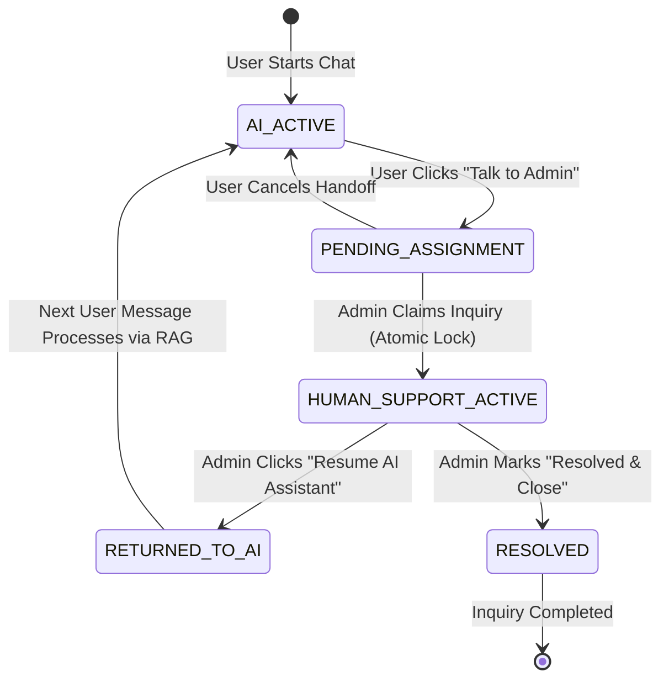

# Human Agent Handoff Specification & Architecture Guide — SunnyTrips AI

> **Document Status**: Architectural Specification & Implementation Reference  
> **Framework Compatibility**: Laravel 11.x / 13.x + Reverb/Pusher WebSockets + Gemini RAG  
> **Target Subsystems**: Chatbot API, Admin Support Queue, Real-time WebSockets, State Machine, Audit Log

---

## Table of Contents

1. [Executive Summary & Architectural Feasibility](#1-executive-summary--architectural-feasibility)
2. [State Machine Architecture](#2-state-machine-architecture)
3. [Database Schema & Migrations](#3-database-schema--migrations)
4. [User-Initiated Handoff & AI Bypassing Pipeline](#4-user-initiated-handoff--ai-bypassing-pipeline)
5. [Atomic Admin Queue & Race Condition Prevention](#5-atomic-admin-queue--race-condition-prevention)
6. [Resuming AI Mode & Context Grounding](#6-resuming-ai-mode--context-grounding)
7. [Real-time WebSockets & Event Notifications](#7-real-time-websockets--event-notifications)
8. [Security, Authorization Policies & Data Isolation](#8-security-authorization-policies--data-isolation)
9. [Laravel Component Breakdown](#9-laravel-component-breakdown)
10. [Future-Proof Extensibility (SLAs & Transfers)](#10-future-proof-extensibility-slas--transfers)

---

## 1. Executive Summary & Architectural Feasibility

### 1.1 Feasibility Assessment

Adding **Human Agent Handoff** to your existing SunnyTrips RAG chatbot is **100% feasible, highly scalable, and clean to integrate**.

Because your architecture already uses:

1. An explicit intent routing controller (`ChatbotController`).
2. A modular RAG context builder (`GeminiService`).
3. Clean Eloquent models for hotels, rooms, and destinations.

Integrating human agent support requires **zero modifications** to vector embeddings or core DB search algorithms. It simply adds a **State Gatekeeper** at the front of your chat controller to determine whether incoming messages are processed by Gemini or routed to an admin.

---

## 2. State Machine Architecture

### 2.1 State Flow Diagram



### 2.2 Formal State Descriptions

| State Enum             | Description                                             | AI Bot Behavior                                     | Admin Access                       |
| ---------------------- | ------------------------------------------------------- | --------------------------------------------------- | ---------------------------------- |
| `AI_ACTIVE`            | Normal automated RAG mode.                              | Generates vector RAG responses via Gemini LLM.      | View-only in analytics             |
| `PENDING_ASSIGNMENT`   | User requested an admin; inquiry in public admin queue. | Paused. Acknowledges request to user.               | All admins can see in Shared Inbox |
| `HUMAN_SUPPORT_ACTIVE` | Assigned to a specific Admin.                           | **COMPLETELY PAUSED**. Ignores LLM calls.           | **Exclusively** assigned Admin     |
| `RETURNED_TO_AI`       | Admin handed conversation back to AI.                   | Resumes LLM responses using human dialogue context. | Read-only archive                  |
| `RESOLVED`             | Support ticket closed.                                  | Resumes standard bot operation or ends session.     | Archived ticket                    |

---

## 3. Database Schema & Migrations

### 3.1 Migration: `create_support_inquiries_table.php`

```php
use Illuminate\Database\Migrations\Migration;
use Illuminate\Database\Schema\Blueprint;
use Illuminate\Support\Facades\Schema;

return new class extends Migration {
    public function up(): void
    {
        Schema::create('support_inquiries', function (Blueprint $table) {
            $table->id();
            $table->string('ticket_number')->unique(); // e.g., TKT-20260729-8812
            $table->foreignId('chat_session_id')->constrained('chat_sessions')->onDelete('cascade');
            $table->foreignId('user_id')->nullable()->constrained('users')->onDelete('set null');
            $table->foreignId('assigned_admin_id')->nullable()->constrained('admins')->onDelete('set null');

            $table->enum('status', [
                'AI_ACTIVE',
                'PENDING_ASSIGNMENT',
                'HUMAN_SUPPORT_ACTIVE',
                'RETURNED_TO_AI',
                'RESOLVED'
            ])->default('PENDING_ASSIGNMENT');

            $table->timestamp('requested_at')->useCurrent();
            $table->timestamp('assigned_at')->nullable();
            $table->timestamp('returned_to_ai_at')->nullable();
            $table->timestamp('resolved_at')->nullable();
            $table->timestamps();

            $table->index(['status', 'assigned_admin_id']);
        });
    }

    public function down(): void
    {
        Schema::dropIfExists('support_inquiries');
    }
};
```

### 3.2 Migration: Update `chat_messages` Sender Enum

```php
Schema::table('chat_messages', function (Blueprint $table) {
    // Add 'admin' as a valid message sender
    $table->enum('sender', ['user', 'bot', 'admin'])->change();
});
```

---

## 4. User-Initiated Handoff & AI Bypassing Pipeline

### 4.1 ChatbotController Routing Logic

When a user sends a message, `ChatbotController` checks active inquiry state **before** executing any Gemini API call:

```php
public function handleIncomingMessage(Request $request, GeminiService $geminiService)
{
    $sessionToken = $request->input('session_token');
    $userMessage = $request->input('message');

    $session = ChatSession::where('session_token', $sessionToken)->firstOrFail();

    // Save user message to database first
    $chatMessage = ChatMessage::create([
        'chat_session_id' => $session->id,
        'sender'          => 'user',
        'message'         => $userMessage
    ]);

    // Check for active human support inquiry
    $activeInquiry = SupportInquiry::where('chat_session_id', $session->id)
        ->whereIn('status', ['PENDING_ASSIGNMENT', 'HUMAN_SUPPORT_ACTIVE'])
        ->first();

    // 🛑 RULE: IF HUMAN SUPPORT IS ACTIVE, BYPASS AI COMPLETELY
    if ($activeInquiry) {
        if ($activeInquiry->status === 'HUMAN_SUPPORT_ACTIVE') {
            // Broadcast user message to assigned admin in real-time
            broadcast(new NewUserMessageForAdminEvent($activeInquiry, $chatMessage))->toOthers();

            return response()->json([
                'status'  => 'human_support_active',
                'message' => 'Your message has been delivered to your assigned support agent.'
            ]);
        }

        if ($activeInquiry->status === 'PENDING_ASSIGNMENT') {
            return response()->json([
                'status'  => 'pending_assignment',
                'message' => 'An administrator will be with you shortly. Your message has been added to the queue.'
            ]);
        }
    }

    // ✅ NORMAL AI MODE: Execute RAG & Gemini LLM response
    $scoredRooms = $geminiService->searchRooms($userMessage);
    $ragContext  = $geminiService->getRoomContext($scoredRooms);

    $botReply = $geminiService->generateResponse($ragContext, $userMessage);

    ChatMessage::create([
        'chat_session_id' => $session->id,
        'sender'          => 'bot',
        'message'         => $botReply
    ]);

    return response()->json(['reply' => $botReply]);
}
```

---

## 5. Atomic Admin Queue & Race Condition Prevention

### 5.1 Preventing Concurrent Claims (Pessimistic Locking)

To prevent two admins from clicking "Claim Inquiry" simultaneously and causing duplicate assignments, use Laravel database pessimistic locking (`lockForUpdate` inside a transaction):

```php
namespace App\Services\Support;

use App\Models\SupportInquiry;
use Illuminate\Support\Facades\DB;
use Exception;

class SupportQueueService
{
    /**
     * Atomically assigns an inquiry to an admin.
     */
    public function claimInquiry(int $inquiryId, int $adminId): SupportInquiry
    {
        return DB::transaction(function () use ($inquiryId, $adminId) {
            // Lock record for update so concurrent requests wait
            $inquiry = SupportInquiry::where('id', $inquiryId)
                ->lockForUpdate()
                ->firstOrFail();

            if ($inquiry->status !== 'PENDING_ASSIGNMENT') {
                throw new Exception('This inquiry has already been claimed by another administrator.');
            }

            $inquiry->update([
                'status'            => 'HUMAN_SUPPORT_ACTIVE',
                'assigned_admin_id' => $adminId,
                'assigned_at'       => now()
            ]);

            // Broadcast real-time removal from shared unassigned queue for all other admins
            broadcast(new InquiryClaimedEvent($inquiry))->toOthers();

            return $inquiry;
        });
    }
}
```

---

## 6. Resuming AI Mode & Context Grounding

When an assigned admin clicks **"Resume AI Assistant"**:

1. Admin clicks button → Calls `POST /admin/support/inquiries/{id}/resume-ai`.
2. Inquiry status updates to `RETURNED_TO_AI` (or `AI_ACTIVE`).
3. When the user sends their next question, Gemini receives the full transcript including the **Admin's human responses**, ensuring seamless continuity!

### 6.1 Inclusive RAG Context Assembly

`GeminiService` formats both user and admin messages into history so Gemini is fully aware of what the admin promised:

```text
=== CONVERSATION HISTORY (INCLUDING HUMAN ADMIN SUPPORT) ===
User: I need an extra bed for Room 102.
Admin (Human Agent John): I checked with housekeeping and we can add a rollaway bed for ₱500/night.
User: Great, does that include breakfast?
Gemini AI Response: As Agent John mentioned, the extra bed is ₱500/night. Breakfast can be added for ₱250 per person at the main dining hall.
```

---

## 7. Real-time WebSockets & Event Notifications

### 7.1 Real-Time Broadcast Events

| Event Class                | Trigger                                   | Audience / Channel             | Front-End Reaction                                   |
| -------------------------- | ----------------------------------------- | ------------------------------ | ---------------------------------------------------- |
| `NewInquiryRequestedEvent` | User clicks "Talk to Admin"               | `private-admin.queue`          | Toast notification + adds ticket to unassigned inbox |
| `InquiryClaimedEvent`      | Admin claims inquiry                      | `private-admin.queue`          | Removes ticket from other admins' screens            |
| `NewAdminMessageEvent`     | Admin sends message                       | `private-chat.{session_token}` | Renders admin reply in user chat widget              |
| `NewUserMessageEvent`      | User sends message while in human support | `private-admin.{admin_id}`     | Live updates admin's chat panel                      |

---

## 8. Security, Authorization Policies & Data Isolation

### 8.1 Authorization Policy (`SupportInquiryPolicy.php`)

```php
namespace App\Policies;

use App\Models\Admin;
use App\Models\SupportInquiry;

class SupportInquiryPolicy
{
    /**
     * Determine if an admin can view and reply to a support inquiry.
     */
    public function viewAndReply(Admin $admin, SupportInquiry $inquiry): bool
    {
        // Unassigned inquiries in pending status can be viewed by all admins
        if ($inquiry->status === 'PENDING_ASSIGNMENT') {
            return true;
        }

        // Assigned inquiries can ONLY be accessed by the assigned admin
        return $inquiry->assigned_admin_id === $admin->id;
    }
}
```

---

## 9. Laravel Component Breakdown

```
app/
├── Events/
│   ├── NewInquiryRequestedEvent.php
│   ├── InquiryClaimedEvent.php
│   └── NewAdminMessageEvent.php
├── Http/
│   ├── Controllers/
│   │   ├── Api/ChatbotController.php        # Checks state & pauses AI
│   │   └── Admin/SupportQueueController.php # Admin inbox & claiming logic
│   └── Middleware/
│       └── EnsureAssignedAdmin.php          # 403 Forbidden for non-assigned admins
├── Models/
│   ├── SupportInquiry.php
│   ├── ChatSession.php
│   └── ChatMessage.php
├── Policies/
│   └── SupportInquiryPolicy.php             # Strict data isolation
└── Services/
    └── Support/
        └── SupportQueueService.php          # Atomic pessimistic locking
```

---

## 10. Future-Proof Extensibility (SLAs & Transfers)

This architecture easily accommodates advanced enterprise features in Phase 2:

- **Agent Transfer**: Update `assigned_admin_id` in a transaction and log to `support_transfers` table.
- **SLA Breach Warnings**: Scheduled cron job flags inquiries where `status === 'PENDING_ASSIGNMENT'` for > 5 minutes.
- **Auto-Resolve Inactivity**: Auto-close tickets if neither user nor admin sends a message for 24 hours.
