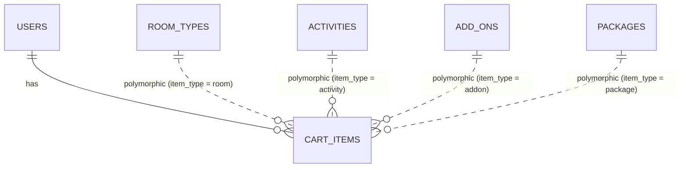

# Travel Booking Cart & Basket System Implementation Plan

We will implement a comprehensive, real-time **Travel Booking Cart & Basket System** ("Add to Cart") for SunnyTrips. This feature allows users to curate their entire vacation package—combining **Rooms & Stays**, **Activities & Tours**, **Tour Packages**, and **Airport Transfers & Add-ons** into a unified travel basket before proceeding to booking checkout.

---

## Technical Approach & Architecture

### 1. Cart Persistence Strategy
- **Session + Database Hybrid**: Guest users store cart items in session/localStorage so they can build a trip without logging in immediately. Authenticated users sync their cart to the database (`cart_items` table) so items persist across devices.

### 2. Airport Transfer Dynamic Pricing
- Transfers (like Boracay Airport to Hotel Roundtrip) use **Pax-Tiered Pricing** (e.g. 1 pax = ₱1,850/head, 4 pax = ₱1,150/head). When the user clicks `+1` / `-1` on passenger count in the cart, the unit rate and total cost automatically update based on the matching pricing tier!

### 3. Item Selection & Partial Checkout
- Each item in the cart has a selection checkbox (`[x]`). Users can uncheck specific items to temporarily exclude them from the current booking checkout total without deleting them from their saved basket.

---

## Proposed Database Schema (`cart_items`)

- `id` (Primary Key)
- `user_id` (Nullable Foreign Key -> `users.id`)
- `session_token` (Nullable String for guest sessions)
- `item_type` (Enum/String / Morph Type: `App\Models\RoomType`, `App\Models\ActivityModel`, `App\Models\AddOnModel`, `App\Models\Package`)
- `item_id` (Unsigned BigInteger / Morph ID)
- `quantity` (Integer: room count, ticket count, pax count)
- `check_in_date` (Nullable Date)
- `check_out_date` (Nullable Date)
- `selected_pax` (Integer)
- `notes` (Nullable Text)
- `timestamps`

---

## ERD & Database Relationship Diagram (Polymorphic)

In your **Entity-Relationship Diagram (ERD)** for Capstone documentation, polymorphic relationships are drawn using logical association lines (dashed lines) connecting `cart_items` to all bookable models:

### Capstone Defense Explanation:
> *"The `cart_items` table uses a Polymorphic Association (`item_type` and `item_id`) allowing a single unified cart table to dynamically reference Rooms, Activities, Add-ons, and Packages without needing multiple nullable foreign key columns."*

---

## Target Workflow & UI Components

1. **Floating Cart Drawer (`cart-drawer.blade.php`)**:
   - Slide-over drawer on the right side of the screen accessible from anywhere on the site.
   - Shows badge count in the header and sidebar.
   - `+` / `-` Quantity control buttons with real-time total updates.
   - Selection checkboxes to toggle items for checkout.
2. **Add to Basket Buttons**:
   - Integrated on Room Cards, Activity Cards, Add-on Cards, and Package Cards.
3. **Dedicated Cart & Trip Summary Page (`/cart`)**:
   - Full desktop itinerary planner & checkout confirmation page.
