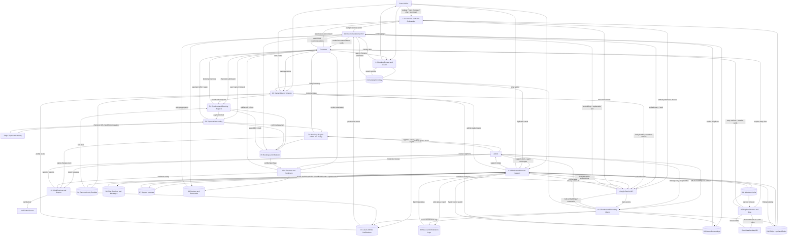

# DFD Level 1 — System Overview

Explodes process `0.0` into 12 major processes. Store IDs are shared with Level 0 boundary (via 0.0) and every Level 2 diagram.

```mermaid
flowchart TB
    %% External entities
    GUEST["Guest Visitor"]
    CUST["Customer"]
    ADMIN["Admin"]
    GEMINI["Google Gemini API"]
    STRIPE["Stripe Payment Gateway"]
    OWM["OpenWeatherMap API"]
    SMTP["SMTP Mail Server"]

    %% Processes 1.0 - 12.0
    P1("1.0 Accounts, Auth and Onboarding")
    P2("2.0 Catalog Browse and Search")
    P3("3.0 Recommendations DSS")
    P4("4.0 Cart and Lucky Itinerary")
    P5("5.0 Checkout and Booking Request")
    P6("6.0 Payment Processing")
    P7("7.0 Booking Lifecycle Admin and Expiry")
    P8("8.0 Chatbot and Human Support")
    P9("9.0 Explore Weather and Map")
    P10("10.0 Reviews and Sentiment")
    P11("11.0 Content and Inventory Mgmt")
    P12("12.0 Notifications and Reports")

    %% Data stores
    D1[("D1 Users Admins Notifications")]
    D2[("D2 Catalog Inventory")]
    D3[("D3 Vector Embeddings")]
    D4[("D4 Cart and Lucky Bundles")]
    D5[("D5 Bookings and Manifests")]
    D6[("D6 Chat Sessions and Messages")]
    D7[("D7 Support Inquiries")]
    D8[("D8 Abuse and Moderation Logs")]
    D9[("D9 Reviews and Summaries")]
    D10[("D10 FAQs Legal and Rules")]
    D11[("D11 Weather Cache")]

    %% --- Guest flows ---
    GUEST -- "register / login / browse / chat / guest cart" --> P1
    GUEST --> P2
    GUEST --> P4
    GUEST --> P8
    P2 -- "catalog pages" --> GUEST
    P8 -- "chat replies" --> GUEST

    %% --- Customer flows ---
    CUST -- "preferences and consent" --> P1
    CUST -- "search / browse" --> P2
    CUST -- "dashboard recommendations" --> P3
    CUST -- "cart operations" --> P4
    CUST -- "checkout submission" --> P5
    CUST -- "pay / cancel / rebook" --> P6
    CUST -- "review submission" --> P10
    CUST -- "explore map view" --> P9
    P3 -- "ranked recommendation cards" --> CUST
    P5 -- "booking reference" --> CUST
    P6 -- "payment URL / result" --> CUST
    P7 -- "booking status" --> CUST
    P9 -- "map markers / weather cards" --> CUST
    P10 -- "published reviews" --> CUST

    %% --- Admin flows ---
    ADMIN -- "support claim / agent messages" --> P8
    ADMIN -- "approve / reject / price adjust" --> P7
    ADMIN -- "CRUD / visibility / re-embed" --> P11
    ADMIN -- "moderate reviews" --> P10
    ADMIN -- "manage FAQ / legal / rules" --> P11
    ADMIN -- "report requests" --> P12
    P8 -- "support tickets" --> ADMIN
    P7 -- "booking queue views" --> ADMIN
    P11 -- "catalog admin UI" --> ADMIN
    P12 -- "reports / exports" --> ADMIN

    %% --- Internal process flows ---
    P1 -- "user preference vector" --> P3
    P2 -- "catalog data" --> P3
    P1 -- "user vector" --> P4
    P4 -- "priced cart snapshot" --> P5
    P5 -- "payment intent" --> P6
    P6 -- "confirmed payment" --> P7
    P7 -- "status change event" --> P12
    P8 -- "add-to-basket cards" --> P4
    P10 -- "sentiment rollup" --> P12

    %% --- External systems ---
    P1 -- "embed preference choices" --> GEMINI
    GEMINI -- "3072-dim vectors" --> P1
    P3 -- "embed query / rank" --> GEMINI
    GEMINI -- "embeddings / explanation text" --> P3
    P4 -- "lucky bundle generation context" --> GEMINI
    P8 -- "generate reply / embeddings" --> GEMINI
    GEMINI -- "LLM answer" --> P8
    P10 -- "sentiment analysis" --> GEMINI
    P11 -- "bulk embeddings / summaries" --> GEMINI
    GEMINI -- "item vectors" --> P11

    P6 -- "create checkout session" --> STRIPE
    STRIPE -- "checkout URL / webhook" --> P6
    P9 -- "forecast fetch on cache miss" --> OWM
    OWM -- "forecast data" --> P9
    P12 -- "send email" --> SMTP

    %% --- Data store writes / reads ---
    P1 --> D1
    P11 --> D1
    P12 --> D1
    P2 --> D2
    P11 --> D2
    P3 --> D3
    P11 --> D3
    P4 --> D4
    P8 --> D4
    P5 --> D5
    P6 --> D5
    P7 --> D5
    P3 --> D5
    P8 -- "persist messages" --> D6
    P8 -- "enqueue / update ticket" --> D7
    P8 -- "write abuse report" --> D8
    P11 -- "review moderation logs" --> D8
    P8 -- "support status updates" --> D7
    P10 --> D9
    P3 --> D9
    P1 --> D10
    P8 --> D10
    P11 --> D10
    P9 --> D11
    P8 --> D11

    D1 -- "preference vector" --> P3
    D1 -- "profile vector" --> P4
    D2 -- "search results" --> P2
    D2 -- "candidates" --> P3
    D2 -- "lucky inventory" --> P4
    D2 -- "hydrated cards" --> P8
    D3 -- "cosine neighbors" --> P3
    D3 -- "cosine neighbors" --> P4
    D3 -- "hybrid vector search" --> P8
    D4 -- "cart lines" --> P5
    D5 -- "availability check" --> P5
    D5 -- "verified purchase" --> P10
    D6 -- "6-turn window" --> P8
    D7 -- "active handoff state" --> P8
    D8 -- "ban / rate status" --> P8
    D9 -- "rating aggregates" --> P3
    D10 -- "FAQ grounding" --> P8
    D11 -- "cached forecast" --> P8
    D11 -- "cached forecast" --> P9
```
