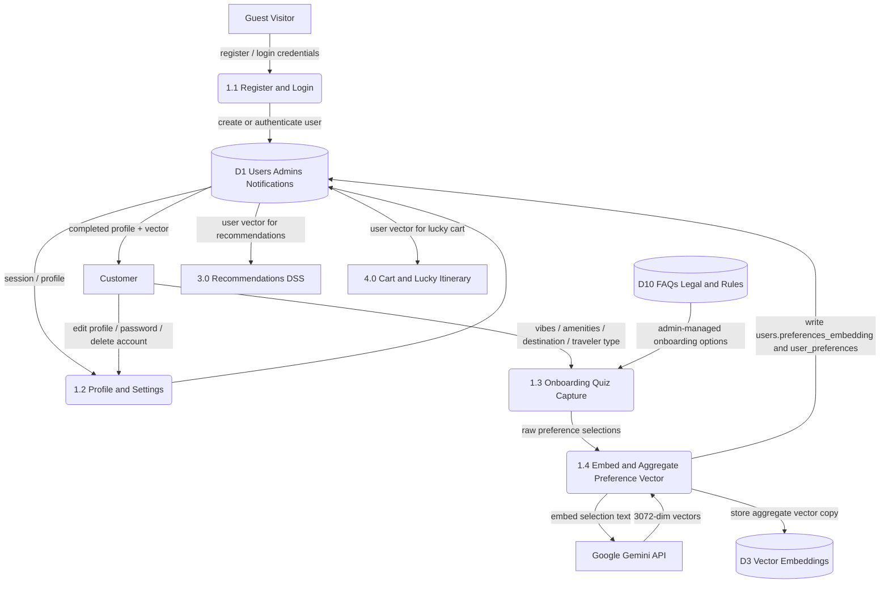

# DFD Level 2 — Process 1.0 Accounts, Auth and Onboarding

Parent: Level 1 process `1.0`. Balances with flows: Guest/Customer auth + preferences in; profile/vector out to D1, P3, P4; Gemini embed; D10 option reads.

