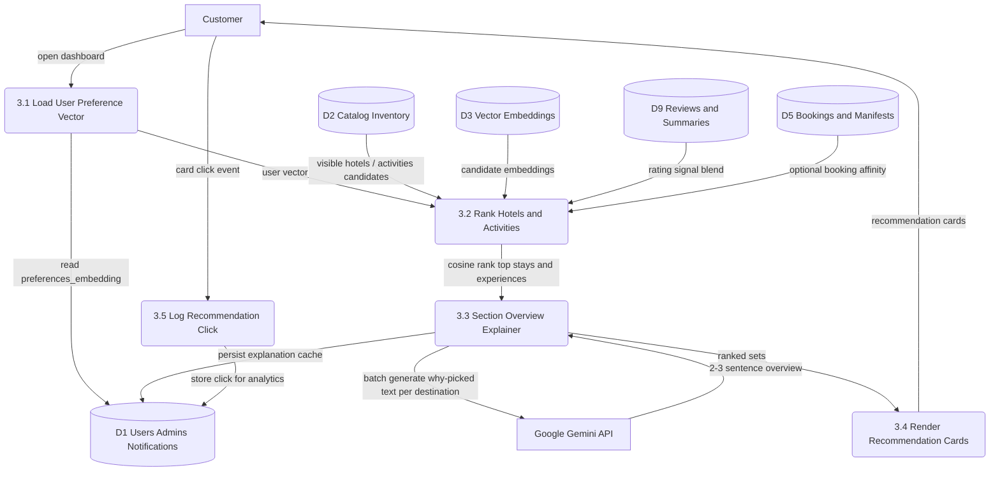

# DFD Level 2 — Process 3.0 Recommendations (DSS)

Parent: Level 1 process `3.0`. Dashboard ranking, cached section overviews, click tracking.

```mermaid
flowchart TB
    CUST["Customer"]
    GEMINI["Google Gemini API"]

    P31("3.1 Load User Preference Vector")
    P32("3.2 Rank Hotels and Activities")
    P33("3.3 Section Overview Explainer")
    P34("3.4 Render Recommendation Cards")
    P35("3.5 Log Recommendation Click")

    D1[("D1 Users Admins Notifications")]
    D2[("D2 Catalog Inventory")]
    D3[("D3 Vector Embeddings")]
    D5[("D5 Bookings and Manifests")]
    D9[("D9 Reviews and Summaries")]

    CUST -- "open dashboard" --> P31
    P31 -- "read preferences_embedding" --> D1
    P31 -- "user vector" --> P32
    D2 -- "visible hotels / activities candidates" --> P32
    D3 -- "candidate embeddings" --> P32
    D9 -- "rating signal blend" --> P32
    D5 -- "optional booking affinity" --> P32
    P32 -- "cosine rank top stays and experiences" --> P33
    P33 -- "batch generate why-picked text per destination" --> GEMINI
    GEMINI -- "2-3 sentence overview" --> P33
    P33 -- "persist explanation cache" --> D1
    P33 -- "ranked sets" --> P34
    P34 -- "recommendation cards" --> CUST
    CUST -- "card click event" --> P35
    P35 -- "store click for analytics" --> D1
```
