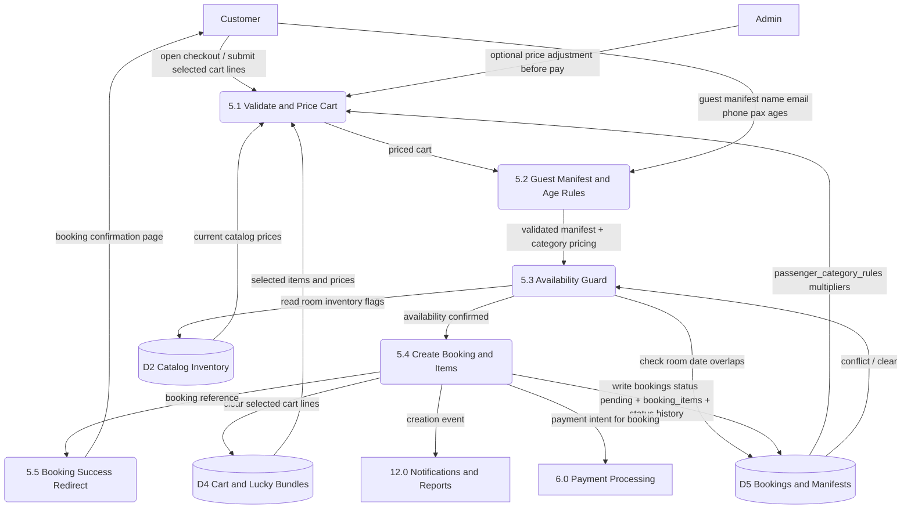

# DFD Level 2 — Process 5.0 Checkout and Booking Request

Parent: Level 1 process `5.0`. Validates cart, applies passenger rules, creates pending booking, hands off to payment.

```mermaid
flowchart TB
    CUST["Customer"]
    ADMIN["Admin"]
    P6["6.0 Payment Processing"]
    P12["12.0 Notifications and Reports"]

    P51("5.1 Validate and Price Cart")
    P52("5.2 Guest Manifest and Age Rules")
    P53("5.3 Availability Guard")
    P54("5.4 Create Booking and Items")
    P55("5.5 Booking Success Redirect")

    D2[("D2 Catalog Inventory")]
    D4[("D4 Cart and Lucky Bundles")]
    D5[("D5 Bookings and Manifests")]

    CUST -- "open checkout / submit selected cart lines" --> P51
    D4 -- "selected items and prices" --> P51
    D5 -- "passenger_category_rules multipliers" --> P51
    D2 -- "current catalog prices" --> P51
    P51 -- "priced cart" --> P52
    CUST -- "guest manifest name email phone pax ages" --> P52
    P52 -- "validated manifest + category pricing" --> P53
    P53 -- "check room date overlaps" --> D5
    P53 -- "read room inventory flags" --> D2
    D5 -- "conflict / clear" --> P53
    P53 -- "availability confirmed" --> P54
    P54 -- "write bookings status pending + booking_items + status history" --> D5
    P54 -- "clear selected cart lines" --> D4
    P54 -- "booking reference" --> P55
    P55 -- "booking confirmation page" --> CUST
    P54 -- "payment intent for booking" --> P6
    ADMIN -- "optional price adjustment before pay" --> P51
    P54 -- "creation event" --> P12
```
