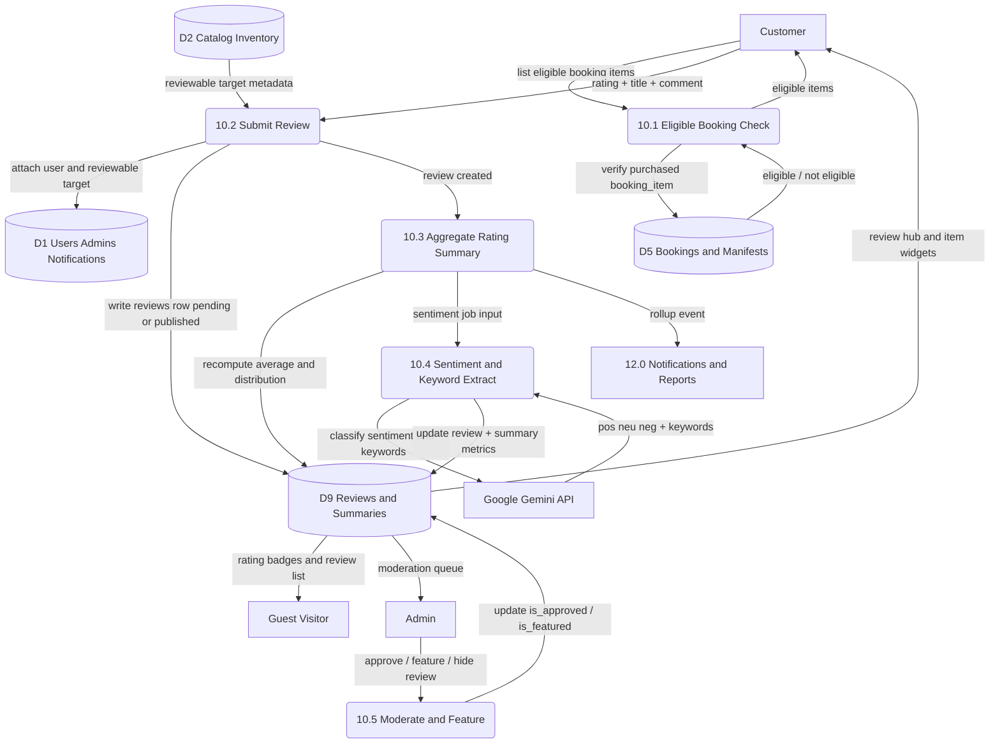

# DFD Level 2 — Process 10.0 Reviews and Sentiment

Parent: Level 1 process `10.0`. Verified booking reviews, aggregation, optional Gemini sentiment.

```mermaid
flowchart TB
    CUST["Customer"]
    ADMIN["Admin"]
    GUEST["Guest Visitor"]
    GEMINI["Google Gemini API"]
    P12["12.0 Notifications and Reports"]

    P101("10.1 Eligible Booking Check")
    P102("10.2 Submit Review")
    P103("10.3 Aggregate Rating Summary")
    P104("10.4 Sentiment and Keyword Extract")
    P105("10.5 Moderate and Feature")

    D1[("D1 Users Admins Notifications")]
    D2[("D2 Catalog Inventory")]
    D5[("D5 Bookings and Manifests")]
    D9[("D9 Reviews and Summaries")]

    CUST -- "list eligible booking items" --> P101
    P101 -- "verify purchased booking_item" --> D5
    D5 -- "eligible / not eligible" --> P101
    P101 -- "eligible items" --> CUST

    CUST -- "rating + title + comment" --> P102
    P102 -- "attach user and reviewable target" --> D1
    P102 -- "write reviews row pending or published" --> D9
    P102 -- "review created" --> P103
    P103 -- "recompute average and distribution" --> D9
    P103 -- "sentiment job input" --> P104
    P104 -- "classify sentiment and keywords" --> GEMINI
    GEMINI -- "pos neu neg + keywords" --> P104
    P104 -- "update review + summary metrics" --> D9
    P103 -- "rollup event" --> P12

    ADMIN -- "approve / feature / hide review" --> P105
    P105 -- "update is_approved / is_featured" --> D9
    D9 -- "rating badges and review list" --> GUEST
    D9 -- "review hub and item widgets" --> CUST
    D9 -- "moderation queue" --> ADMIN
    D2 -- "reviewable target metadata" --> P102
```
