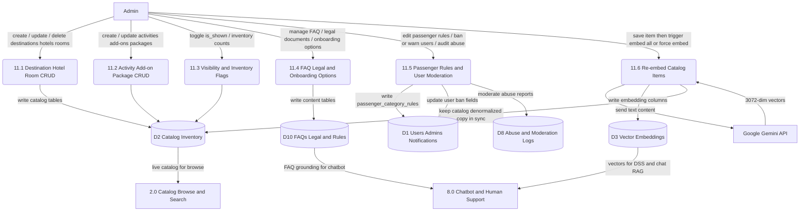

# DFD Level 2 — Process 11.0 Content and Inventory Management

Parent: Level 1 process `11.0`. Admin CRUD for catalog, FAQs, legal, onboarding options, passenger rules; re-embed trigger; abuse moderation.

