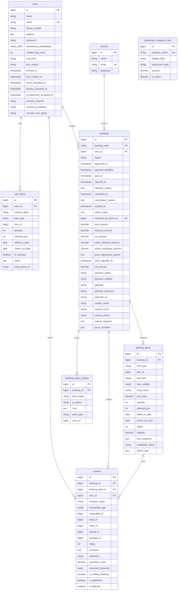

# ERD-B — Booking & Payment Subsystem

```mermaid
erDiagram
    users ||--o{ cart_items : "has"
    users ||--o{ bookings : "creates"
    users ||--o{ reviews : "writes"

    admins ||--o{ bookings : "reviews"

    bookings ||--|{ booking_items : "contains"
    bookings ||--|{ booking_status_history : "tracks"
    bookings ||--o{ reviews : "collects"

    booking_items ||--o{ reviews : "rates"

    users {
        bigint id PK
        string name
        string email UK
        string phone_number
        text address
        string password
        vector_3072 preferences_embedding
        int chatbot_flag_count
        string ban_level
        string ban_reason
        timestamp banned_at
        timestamp ban_expires_at
        timestamp terms_accepted_at
        timestamp privacy_accepted_at
        timestamp ai_disclosure_accepted_at
        string consent_versions
        string consent_ip_address
        string consent_user_agent
    }

    admins {
        bigint id PK
        string name
        string email UK
        string password
    }

    cart_items {
        bigint id PK
        bigint user_id FK
        string session_token
        string item_type
        bigint item_id
        int quantity
        int selected_pax
        date check_in_date
        date check_out_date
        boolean is_selected
        text notes
        string lucky_group_id
    }

    bookings {
        bigint id PK
        string booking_code UK
        bigint user_id FK
        string status
        timestamp approved_at
        timestamp payment_deadline
        timestamp paid_at
        timestamp rejected_at
        text rejection_reason
        timestamp cancelled_at
        text cancellation_reason
        timestamp expired_at
        text admin_notes
        bigint reviewed_by_admin_id FK
        decimal total_amount
        decimal discount_amount
        decimal tax_amount
        decimal admin_discount_amount
        decimal admin_surcharge_amount
        text price_adjustment_reason
        timestamp price_adjusted_at
        decimal net_amount
        string payment_status
        string payment_method
        string gateway
        string gateway_reference
        string payment_url
        string contact_name
        string contact_email
        string contact_phone
        text special_requests
        json guest_manifest
    }

    booking_items {
        bigint id PK
        bigint booking_id FK
        string item_type
        bigint item_id
        string item_title
        string item_subtitle
        string hotel_name
        decimal unit_price
        int quantity
        int selected_pax
        date check_in_date
        date check_out_date
        int nights
        decimal subtotal
        json item_snapshot
        string availability_status
        text admin_note
    }

    booking_status_history {
        bigint id PK
        bigint booking_id FK
        string from_status
        string to_status
        text note
        string actor_type
        bigint actor_id
    }

    passenger_category_rules {
        bigint id PK
        string category_name UK
        string display_label
        string adjustment_type
        decimal amount
        boolean is_active
    }

    reviews {
        bigint id PK
        bigint booking_id FK
        bigint booking_item_id FK
        bigint user_id FK
        string reviewer_name
        string reviewable_type
        bigint reviewable_id
        bigint hotel_id
        bigint room_id
        bigint activity_id
        bigint package_id
        int rating
        text comment
        string sentiment
        decimal sentiment_score
        jsonb extracted_keywords
        boolean is_verified_booking
        boolean is_published
        boolean is_featured
    }
```
