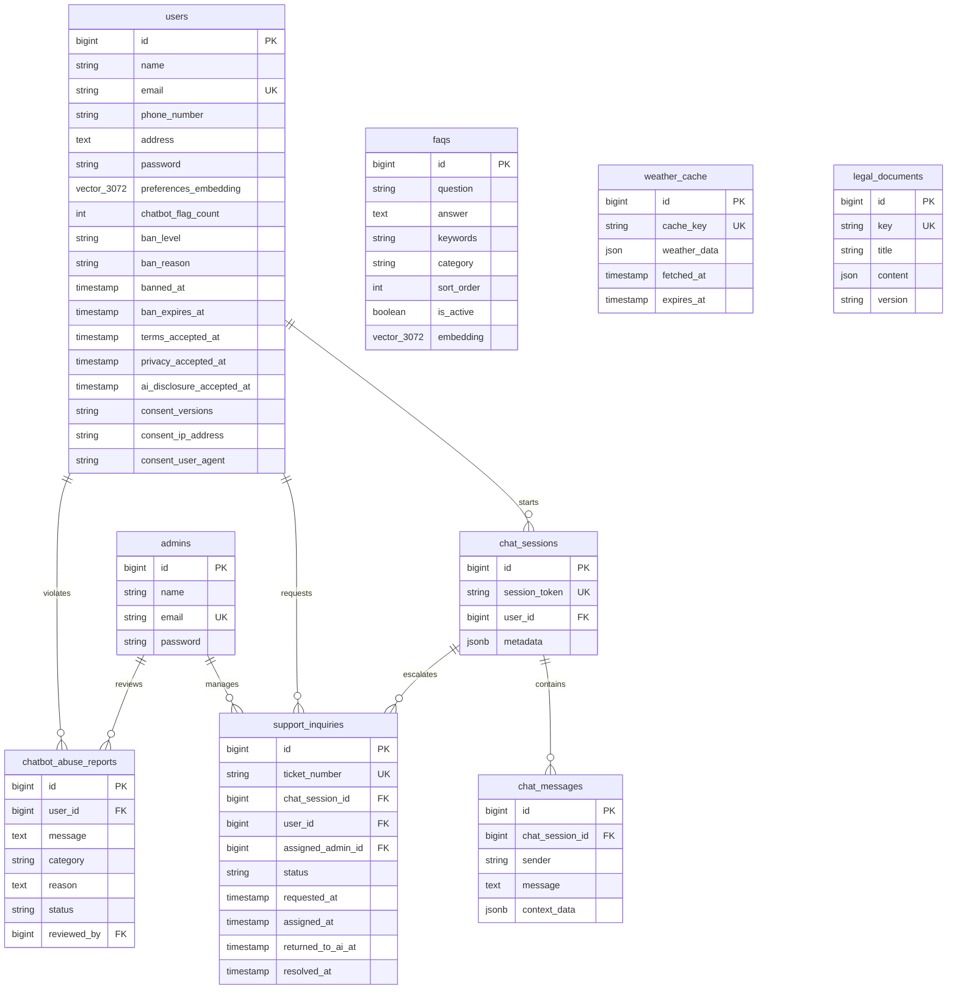

# ERD-C — Chatbot & Support Subsystem

```mermaid
erDiagram
    users ||--o{ chat_sessions : "starts"
    users ||--o{ support_inquiries : "requests"
    users ||--o{ chatbot_abuse_reports : "violates"

    admins ||--o{ support_inquiries : "manages"
    admins ||--o{ chatbot_abuse_reports : "reviews"

    chat_sessions ||--o{ chat_messages : "contains"
    chat_sessions ||--o{ support_inquiries : "escalates"

    users {
        bigint id PK
        string name
        string email UK
        string phone_number
        text address
        string password
        vector_3072 preferences_embedding
        int chatbot_flag_count
        string ban_level
        string ban_reason
        timestamp banned_at
        timestamp ban_expires_at
        timestamp terms_accepted_at
        timestamp privacy_accepted_at
        timestamp ai_disclosure_accepted_at
        string consent_versions
        string consent_ip_address
        string consent_user_agent
    }

    admins {
        bigint id PK
        string name
        string email UK
        string password
    }

    chat_sessions {
        bigint id PK
        string session_token UK
        bigint user_id FK
        jsonb metadata
    }

    chat_messages {
        bigint id PK
        bigint chat_session_id FK
        string sender
        text message
        jsonb context_data
    }

    support_inquiries {
        bigint id PK
        string ticket_number UK
        bigint chat_session_id FK
        bigint user_id FK
        bigint assigned_admin_id FK
        string status
        timestamp requested_at
        timestamp assigned_at
        timestamp returned_to_ai_at
        timestamp resolved_at
    }

    chatbot_abuse_reports {
        bigint id PK
        bigint user_id FK
        text message
        string category
        text reason
        string status
        bigint reviewed_by FK
    }

    faqs {
        bigint id PK
        string question
        text answer
        string keywords
        string category
        int sort_order
        boolean is_active
        vector_3072 embedding
    }

    weather_cache {
        bigint id PK
        string cache_key UK
        json weather_data
        timestamp fetched_at
        timestamp expires_at
    }

    legal_documents {
        bigint id PK
        string key UK
        string title
        json content
        string version
    }
```
