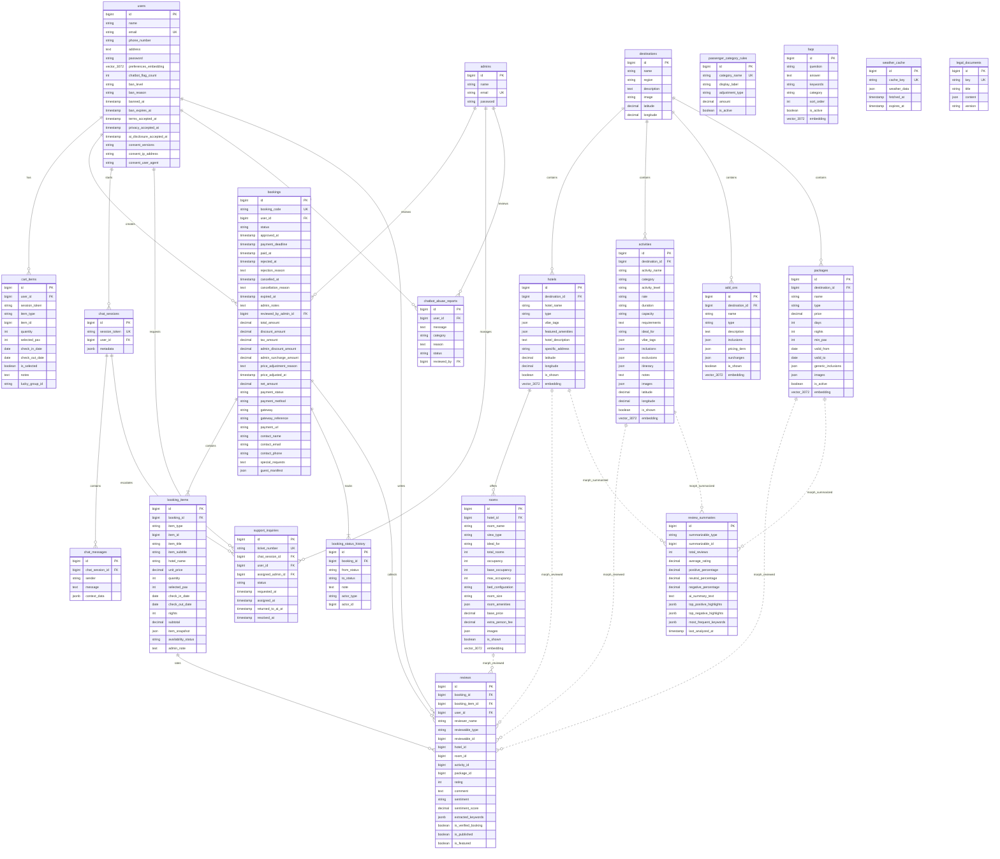

# Full System ERD (Mermaid.js)

```mermaid
erDiagram
    users ||--o{ cart_items : "has"
    users ||--o{ bookings : "creates"
    users ||--o{ chat_sessions : "starts"
    users ||--o{ support_inquiries : "requests"
    users ||--o{ chatbot_abuse_reports : "violates"
    users ||--o{ reviews : "writes"

    admins ||--o{ bookings : "reviews"
    admins ||--o{ support_inquiries : "manages"
    admins ||--o{ chatbot_abuse_reports : "reviews"

    destinations ||--o{ hotels : "contains"
    destinations ||--o{ activities : "contains"
    destinations ||--o{ add_ons : "contains"
    destinations ||--o{ packages : "contains"

    hotels ||--o{ rooms : "offers"

    bookings ||--|{ booking_items : "contains"
    bookings ||--|{ booking_status_history : "tracks"
    bookings ||--o{ reviews : "collects"

    booking_items ||--o{ reviews : "rates"

    chat_sessions ||--o{ chat_messages : "contains"
    chat_sessions ||--o{ support_inquiries : "escalates"

    hotels ||..o{ reviews : "morph_reviewed"
    rooms ||..o{ reviews : "morph_reviewed"
    activities ||..o{ reviews : "morph_reviewed"
    packages ||..o{ reviews : "morph_reviewed"

    hotels ||..o{ review_summaries : "morph_summarized"
    activities ||..o{ review_summaries : "morph_summarized"
    packages ||..o{ review_summaries : "morph_summarized"

    users {
        bigint id PK
        string name
        string email UK
        string phone_number
        text address
        string password
        vector_3072 preferences_embedding
        int chatbot_flag_count
        string ban_level
        string ban_reason
        timestamp banned_at
        timestamp ban_expires_at
        timestamp terms_accepted_at
        timestamp privacy_accepted_at
        timestamp ai_disclosure_accepted_at
        string consent_versions
        string consent_ip_address
        string consent_user_agent
    }

    admins {
        bigint id PK
        string name
        string email UK
        string password
    }

    destinations {
        bigint id PK
        string name
        string region
        text description
        string image
        decimal latitude
        decimal longitude
    }

    hotels {
        bigint id PK
        bigint destination_id FK
        string hotel_name
        string type
        json vibe_tags
        json featured_amenities
        text hotel_description
        string specific_address
        decimal latitude
        decimal longitude
        boolean is_shown
        vector_3072 embedding
    }

    rooms {
        bigint id PK
        bigint hotel_id FK
        string room_name
        string view_type
        string ideal_for
        int total_rooms
        int occupancy
        int base_occupancy
        int max_occupancy
        string bed_configuration
        string room_size
        json room_amenities
        decimal base_price
        decimal extra_person_fee
        json images
        boolean is_shown
        vector_3072 embedding
    }

    activities {
        bigint id PK
        bigint destination_id FK
        string activity_name
        string category
        string activity_level
        string rate
        string duration
        string capacity
        text requirements
        string ideal_for
        json vibe_tags
        json inclusions
        json exclusions
        json itinerary
        text notes
        json images
        decimal latitude
        decimal longitude
        boolean is_shown
        vector_3072 embedding
    }

    add_ons {
        bigint id PK
        bigint destination_id FK
        string name
        string type
        text description
        json inclusions
        json pricing_tiers
        json surcharges
        boolean is_shown
        vector_3072 embedding
    }

    packages {
        bigint id PK
        bigint destination_id FK
        string name
        string type
        decimal price
        int days
        int nights
        int min_pax
        date valid_from
        date valid_to
        json generic_inclusions
        json images
        boolean is_active
        vector_3072 embedding
    }

    cart_items {
        bigint id PK
        bigint user_id FK
        string session_token
        string item_type
        bigint item_id
        int quantity
        int selected_pax
        date check_in_date
        date check_out_date
        boolean is_selected
        text notes
        string lucky_group_id
    }

    bookings {
        bigint id PK
        string booking_code UK
        bigint user_id FK
        string status
        timestamp approved_at
        timestamp payment_deadline
        timestamp paid_at
        timestamp rejected_at
        text rejection_reason
        timestamp cancelled_at
        text cancellation_reason
        timestamp expired_at
        text admin_notes
        bigint reviewed_by_admin_id FK
        decimal total_amount
        decimal discount_amount
        decimal tax_amount
        decimal admin_discount_amount
        decimal admin_surcharge_amount
        text price_adjustment_reason
        timestamp price_adjusted_at
        decimal net_amount
        string payment_status
        string payment_method
        string gateway
        string gateway_reference
        string payment_url
        string contact_name
        string contact_email
        string contact_phone
        text special_requests
        json guest_manifest
    }

    booking_items {
        bigint id PK
        bigint booking_id FK
        string item_type
        bigint item_id
        string item_title
        string item_subtitle
        string hotel_name
        decimal unit_price
        int quantity
        int selected_pax
        date check_in_date
        date check_out_date
        int nights
        decimal subtotal
        json item_snapshot
        string availability_status
        text admin_note
    }

    booking_status_history {
        bigint id PK
        bigint booking_id FK
        string from_status
        string to_status
        text note
        string actor_type
        bigint actor_id
    }

    passenger_category_rules {
        bigint id PK
        string category_name UK
        string display_label
        string adjustment_type
        decimal amount
        boolean is_active
    }

    reviews {
        bigint id PK
        bigint booking_id FK
        bigint booking_item_id FK
        bigint user_id FK
        string reviewer_name
        string reviewable_type
        bigint reviewable_id
        bigint hotel_id
        bigint room_id
        bigint activity_id
        bigint package_id
        int rating
        text comment
        string sentiment
        decimal sentiment_score
        jsonb extracted_keywords
        boolean is_verified_booking
        boolean is_published
        boolean is_featured
    }

    review_summaries {
        bigint id PK
        string summarizable_type
        bigint summarizable_id
        int total_reviews
        decimal average_rating
        decimal positive_percentage
        decimal neutral_percentage
        decimal negative_percentage
        text ai_summary_text
        jsonb top_positive_highlights
        jsonb top_negative_highlights
        jsonb most_frequent_keywords
        timestamp last_analyzed_at
    }

    chat_sessions {
        bigint id PK
        string session_token UK
        bigint user_id FK
        jsonb metadata
    }

    chat_messages {
        bigint id PK
        bigint chat_session_id FK
        string sender
        text message
        jsonb context_data
    }

    support_inquiries {
        bigint id PK
        string ticket_number UK
        bigint chat_session_id FK
        bigint user_id FK
        bigint assigned_admin_id FK
        string status
        timestamp requested_at
        timestamp assigned_at
        timestamp returned_to_ai_at
        timestamp resolved_at
    }

    chatbot_abuse_reports {
        bigint id PK
        bigint user_id FK
        text message
        string category
        text reason
        string status
        bigint reviewed_by FK
    }

    faqs {
        bigint id PK
        string question
        text answer
        string keywords
        string category
        int sort_order
        boolean is_active
        vector_3072 embedding
    }

    weather_cache {
        bigint id PK
        string cache_key UK
        json weather_data
        timestamp fetched_at
        timestamp expires_at
    }

    legal_documents {
        bigint id PK
        string key UK
        string title
        json content
        string version
    }
```
