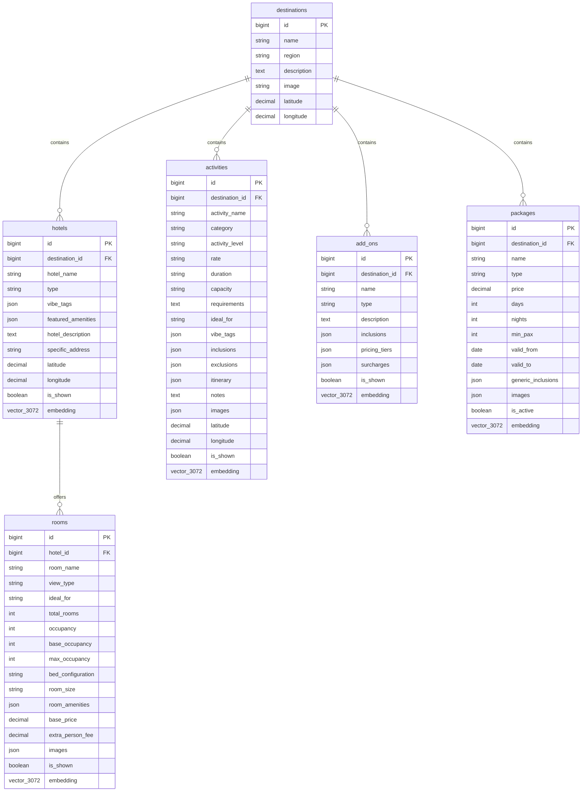

# Figure 1: Catalog & Destination Module ERD

```mermaid
erDiagram
    destinations ||--o{ hotels : "contains"
    destinations ||--o{ activities : "contains"
    destinations ||--o{ add_ons : "contains"
    destinations ||--o{ packages : "contains"

    hotels ||--o{ rooms : "offers"

    destinations {
        bigint id PK
        string name
        string region
        text description
        string image
        decimal latitude
        decimal longitude
    }

    hotels {
        bigint id PK
        bigint destination_id FK
        string hotel_name
        string type
        json vibe_tags
        json featured_amenities
        text hotel_description
        string specific_address
        decimal latitude
        decimal longitude
        boolean is_shown
        vector_3072 embedding
    }

    rooms {
        bigint id PK
        bigint hotel_id FK
        string room_name
        string view_type
        string ideal_for
        int total_rooms
        int occupancy
        int base_occupancy
        int max_occupancy
        string bed_configuration
        string room_size
        json room_amenities
        decimal base_price
        decimal extra_person_fee
        json images
        boolean is_shown
        vector_3072 embedding
    }

    activities {
        bigint id PK
        bigint destination_id FK
        string activity_name
        string category
        string activity_level
        string rate
        string duration
        string capacity
        text requirements
        string ideal_for
        json vibe_tags
        json inclusions
        json exclusions
        json itinerary
        text notes
        json images
        decimal latitude
        decimal longitude
        boolean is_shown
        vector_3072 embedding
    }

    add_ons {
        bigint id PK
        bigint destination_id FK
        string name
        string type
        text description
        json inclusions
        json pricing_tiers
        json surcharges
        boolean is_shown
        vector_3072 embedding
    }

    packages {
        bigint id PK
        bigint destination_id FK
        string name
        string type
        decimal price
        int days
        int nights
        int min_pax
        date valid_from
        date valid_to
        json generic_inclusions
        json images
        boolean is_active
        vector_3072 embedding
    }
```
