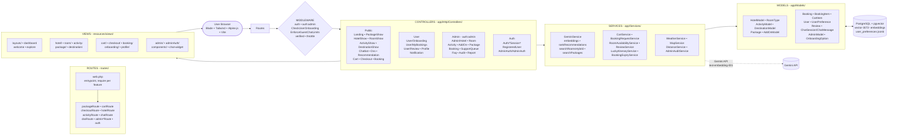

# SunnyTrips MVC Architecture — Project-Specific

Mermaid source. Renders on GitHub / Notion / Obsidian. Or paste at https://mermaid.live → Export PNG/SVG.

```mermaid
flowchart LR
    User([User Browser<br/>Blade + Tailwind + Alpine.js + Vite]) --> Routes

    subgraph ROUTES["ROUTES - routes/"]
        Web["web.php<br/>entrypoint, require per feature"]
        Feature["packageRoute • cartRoute<br/>checkoutRoute • hotelRoute<br/>activityRoute • chatRoute<br/>dssRoute • admin*Route • auth"]
        Web --> Feature
    end

    Routes --> MW{MIDDLEWARE<br/>auth • auth:admin<br/>CheckUserOnboarding<br/>EnforceGuestChatLimits<br/>verified • throttle}

    MW --> CTRL

    subgraph CTRL["CONTROLLERS - app/Http/Controllers/"]
        direction TB
        Public["Public<br/>Landing • PackageShow<br/>HotelShow • RoomShow<br/>ActivityShow • DestinationShow<br/>Chatbot • Dss • Recommendation<br/>Cart • Checkout • Booking"]
        UserC["User<br/>User/Onboarding<br/>User/MyBookings<br/>User/Review • Profile<br/>Notification"]
        AdminC["Admin - auth:admin<br/>Admin/Hotel • Room<br/>Activity • AddOn • Package<br/>Booking • SupportQueue<br/>Faq • Audit • Report"]
        AuthC["Auth<br/>Auth/*Session*<br/>RegisteredUser<br/>AdminAuth/AdminAuth"]
    end

    CTRL --> SVC

    subgraph SVC["SERVICES - app/Services/"]
        direction TB
        Gemini["GeminiService<br/>embeddings • rankRecommendations<br/>searchRoomsHybrid • searchPackages"]
        Domain["CartService • BookingRequestService<br/>RoomAvailabilityService • ReviewService<br/>LuckyItineraryService • BookingExpiryService"]
        Ext["WeatherService • MapService<br/>DistanceService • AdminAuditService"]
    end

    SVC --> MODELS

    subgraph MODELS["MODELS - app/Models/"]
        direction TB
        M1["HotelModel • RoomType<br/>ActivityModel • DestinationModel<br/>Package • AddOnModel"]
        M2["Booking • BookingItem • CartItem<br/>User • UserPreference<br/>Review • ChatSession/ChatMessage<br/>AdminModel • OnboardingOption"]
    end

    MODELS <--> DB[("PostgreSQL + pgvector<br/>vector-3072- embeddings<br/>user_preferences jsonb")]

    CTRL --> VIEWS

    subgraph VIEWS["VIEWS - resources/views/"]
        direction TB
        V1["layouts/ • dashboard<br/>welcome • explore"]
        V2["hotel/ • room/ • activity/<br/>package/ • destination/"]
        V3["cart/ • checkout/ • booking/<br/>onboarding/ • profile/"]
        V4["admin/ • adminAuth/<br/>components/ • chat-widget"]
    end

    VIEWS --> User
    SVC -.->|"Gemini API<br/>text-embedding-001"| GeminiAPI[(Gemini API)]
```
