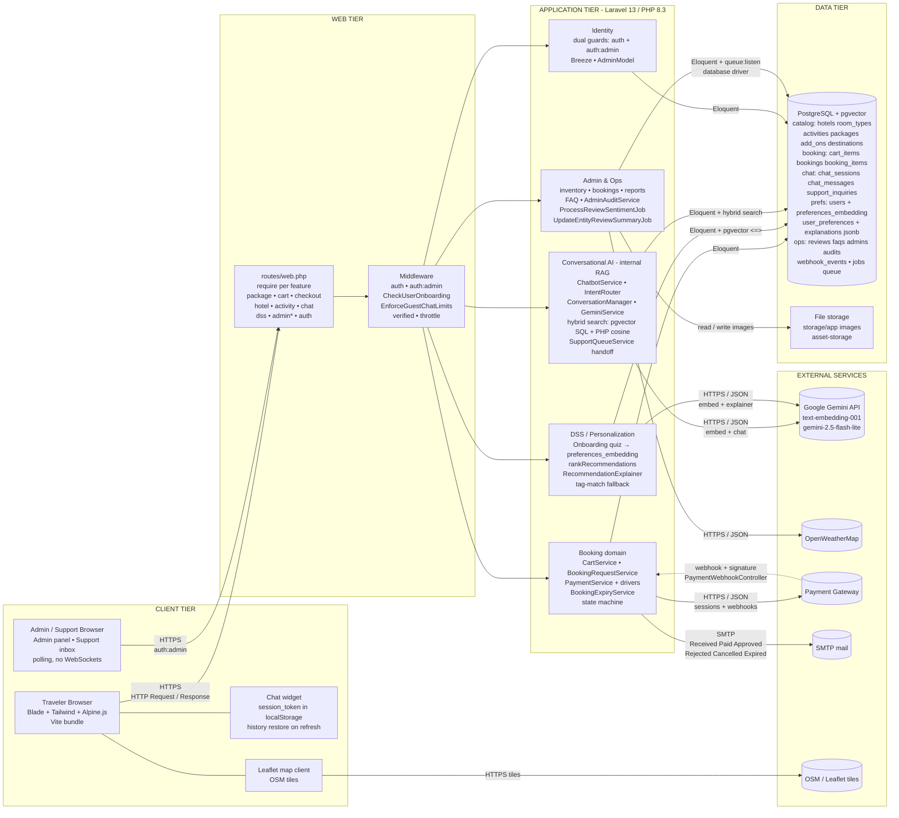

# SunnyTrips System Architecture

Mermaid source. Renders on GitHub / Notion / Obsidian. Or paste at https://mermaid.live → Export PNG/SVG.

## Component traceability

| Diagram box         | Real source                                                                                                                                                         |
| ------------------- | ------------------------------------------------------------------------------------------------------------------------------------------------------------------- |
| Routes + middleware | `routes/web.php`, `routes/*Route.php`, `CheckUserOnboarding`, `EnforceGuestChatLimits`                                                                              |
| Identity            | `AdminModel`, `auth:admin` guard, Breeze `Auth/*` controllers                                                                                                       |
| Booking domain      | `CartService`, `BookingRequestService`, `PaymentService` + Stripe/QRPH/Simulator drivers, `PaymentWebhookController`, `BookingExpiryService`                        |
| DSS                 | `RecommendationController`, `OnboardingController`, `GeminiService::rankRecommendations`, `RecommendationExplainer`, `user_preferences.recommendation_explanations` |
| RAG (internal)      | `Services/Chat/ChatbotService`, `IntentRouter`, `ConversationManager`, `SupportQueueService`, `chat_sessions.session_token`                                         |
| Admin & Ops         | `Admin/*` controllers, `AdminAuditService`, `ProcessReviewSentimentJob`, `UpdateEntityReviewSummaryJob`                                                             |
| Data                | PostgreSQL + pgvector `vector(3072)`, `jobs` table (database queue), `storage/app` images                                                                           |
| External            | `config/services.php` (gemini, stripe, qrph/paymongo, openweather), SMTP mailers, OSM tiles                                                                         |
