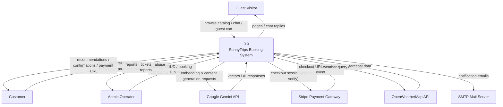
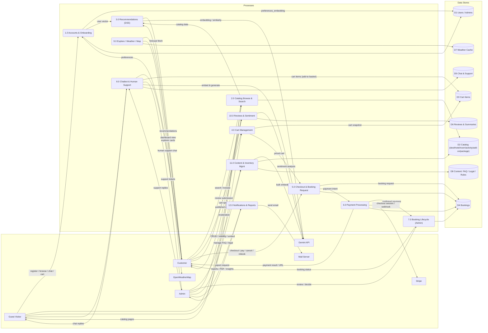
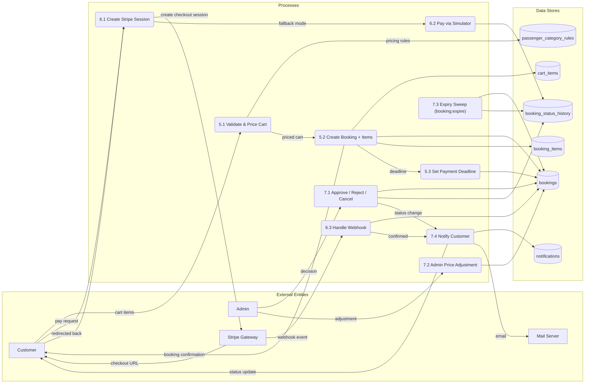
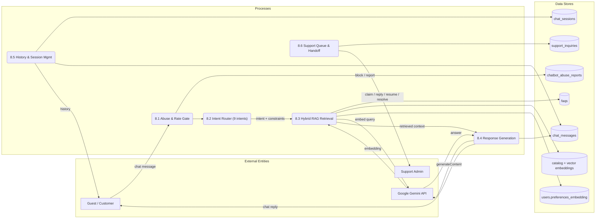
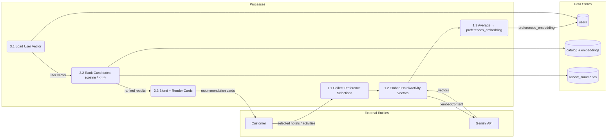

# SunnyTrips — System Diagrams (Mermaid)

Paste any block below into [mermaid.live](https://mermaid.live) to render. All diagrams are generated from the current codebase (Gane–Sarson convention).

## Gane–Sarson notation used

| Element | Mermaid shape | Renders as |
|---|---|---|
| Process | `("1.0 Name")` | rounded rectangle |
| External entity | `["Guest Visitor"]` | rectangle (square) |
| Data store | `[("D1 Name")]` | cylinder (closest Mermaid approximation of the open-end rectangle) |
| Data flow | `A -->\|"label"\| B` | labeled arrow |

Mermaid has no native "open-end box" store symbol; the cylinder is the closest widely-used substitute.

---

## DFD Level 0 — Context Diagram



---

## DFD Level 1 — System Decomposition



---

## DFD Level 2 — (a) Checkout → Booking → Lifecycle (P5–P7)



---

## DFD Level 2 — (b) Chatbot & Human Handoff (P8)



---

## DFD Level 2 — (c) Onboarding & Recommendations (P1 → P3)



---

## ERD-A — Catalog & Browse

```mermaid
erDiagram
    DESTINATION ||--o{ HOTEL : "holds"
    DESTINATION ||--o{ ACTIVITY : "hosts"
    DESTINATION ||--o{ ADDON : "offers"
    DESTINATION ||--o{ PACKAGE : "bundles"
    HOTEL ||--o{ ROOM : "contains"
    PACKAGE }o--o{ HOTEL : "via package_hotel"
    PACKAGE }o--o{ ACTIVITY : "via package_activity"

    HOTEL ||--o{ REVIEW : "morph reviewable"
    ROOM ||--o{ REVIEW : "morph reviewable"
    ACTIVITY ||--o{ REVIEW : "morph reviewable"
    PACKAGE ||--o{ REVIEW : "morph reviewable"
    HOTEL ||--o| REVIEW_SUMMARY : "morph summarizable"
    ROOM ||--o| REVIEW_SUMMARY
    ACTIVITY ||--o| REVIEW_SUMMARY
    PACKAGE ||--o| REVIEW_SUMMARY
    USER ||--o{ REVIEW : "writer (see ERD-B)"

    DESTINATION {
        bigint id PK
        varchar name
        varchar region
        text description
        varchar image
        decimal latitude longitude
    }
    HOTEL {
        bigint id PK
        varchar hotel_name
        bigint destination_id FK
        varchar type
        json vibe_tags featured_amenities
        text hotel_description
        varchar specific_address
        decimal latitude longitude
        bool is_shown
        varchar embedding "vector(3072)"
    }
    ROOM {
        bigint id PK
        bigint hotel_id FK
        varchar room_name
        int total_rooms base_occupancy max_occupancy
        decimal base_price extra_person_fee
        json room_amenities images
        bool is_shown
        varchar embedding "vector(3072)"
    }
    ACTIVITY {
        bigint id PK
        bigint destination_id FK
        varchar activity_name category
        varchar rate duration
        json vibe_tags inclusions exclusions itinerary
        decimal latitude longitude
        bool is_shown
        varchar embedding "vector(3072)"
    }
    ADDON {
        bigint id PK
        bigint destination_id FK
        varchar name type
        json pricing_tiers surcharges
        bool is_shown
        varchar embedding "vector(3072)"
    }
    PACKAGE {
        bigint id PK
        bigint destination_id FK
        varchar name type
        decimal price
        int days nights min_pax
        date valid_from valid_to
        json generic_inclusions images
        bool is_active
        varchar embedding "vector(3072)"
    }
    REVIEW {
        bigint id PK
        varchar reviewable_type reviewable_id "morph target"
        bigint booking_id FK "nullable"
        bigint booking_item_id FK "nullable"
        bigint user_id FK "nullable"
        int rating "CHECK 1-5"
        text comment
        varchar sentiment "pos/neu/neg"
        decimal sentiment_score
        jsonb extracted_keywords
        bool is_verified_booking is_published is_featured
    }
    REVIEW_SUMMARY {
        bigint id PK
        varchar summarizable_type summarizable_id "NULL id = SunnyTripsOverall"
        int total_reviews
        decimal average_rating
        decimal pos_pct neu_pct neg_pct
        text ai_summary_text
        jsonb top_highlights most_frequent_keywords
    }
```

---

## ERD-B — Booking & Payment

```mermaid
erDiagram
    USER ||--o{ CART_ITEM : "owns (or session_token)"
    USER ||--o{ BOOKING : "places"
    ADMIN ||--o{ BOOKING : "reviewed_by_admin_id"
    USER ||--o{ REVIEW : "writer"
    BOOKING ||--o{ BOOKING_ITEM : "contains"
    BOOKING ||--o{ BOOKING_STATUS_HISTORY : "audits"
    BOOKING ||--o{ REVIEW : "verified booking"
    BOOKING_ITEM ||--o{ REVIEW : "per-item review"
    BOOKING_ITEM }o--o{ CATALOG_ITEM : "polymorphic item_id"
    PASSENGER_RULE ||--o{ BOOKING_ITEM : "pricing rule (no FK)"

    USER {
        bigint id PK
        varchar name email UK
        varchar phone_number address
        varchar password
        varchar preferences_embedding "vector(3072)"
        int chatbot_flag_count
        varchar ban_level "warn/temp/permanent"
        timestamp banned_at ban_expires_at
        varchar consent_cols "terms/privacy/ai + versions"
    }
    ADMIN {
        bigint id PK
        varchar name email UK password
    }
    CART_ITEM {
        bigint id PK
        bigint user_id FK "or session_token"
        varchar item_type item_id "morph: room/activity/addon/package"
        int quantity selected_pax
        date check_in_date check_out_date
        bool is_selected
        varchar lucky_group_id
    }
    BOOKING {
        bigint id PK
        varchar booking_code UK
        bigint user_id FK
        varchar status "pending/approved/paid/completed/rejected/cancelled/expired"
        timestamp approved_at payment_deadline paid_at rejected_at cancelled_at
        bigint reviewed_by_admin_id FK
        decimal total_amount discount tax "admin_discount/surcharge"
        decimal net_amount
        varchar payment_status "unpaid/partial/paid/refunded"
        varchar payment_method gateway gateway_reference payment_url
        varchar contact_name contact_email contact_phone
        json guest_manifest
    }
    BOOKING_ITEM {
        bigint id PK
        bigint booking_id FK
        varchar item_type item_id "morph"
        varchar item_title hotel_name
        decimal unit_price subtotal
        int quantity selected_pax nights
        date check_in_date check_out_date
        varchar availability_status "pending/available/unavailable"
        json item_snapshot
    }
    BOOKING_STATUS_HISTORY {
        bigint id PK
        bigint booking_id FK
        varchar from_status to_status
        text note
        varchar actor_type actor_id "polymorphic User/Admin"
    }
    PASSENGER_RULE {
        bigint id PK
        varchar category_name UK
        varchar display_label
        varchar adjustment_type "discount/surcharge/none"
        decimal amount
        bool is_active
    }
    REVIEW {
        bigint id PK
        bigint booking_id FK "nullable"
        bigint booking_item_id FK "nullable"
        bigint user_id FK "nullable"
        int rating comment sentiment
        bool is_published
    }
```

---

## ERD-C — Chatbot & Support

```mermaid
erDiagram
    USER ||--o{ CHAT_SESSION : "owns (nullable)"
    CHAT_SESSION ||--o{ CHAT_MESSAGE : "has"
    CHAT_SESSION ||--o{ SUPPORT_INQUIRY : "escalates"
    USER ||--o{ SUPPORT_INQUIRY : "requests (nullable)"
    USER ||--o{ ABUSE_REPORT : "violates"
    ADMIN ||--o{ ABUSE_REPORT : "reviewed_by"
    ADMIN ||--o{ SUPPORT_INQUIRY : "assigned_admin_id"

    CHAT_SESSION {
        bigint id PK
        varchar session_token UK
        bigint user_id FK "guest allowed"
        jsonb metadata
    }
    CHAT_MESSAGE {
        bigint id PK
        bigint chat_session_id FK
        varchar sender "user/bot/admin"
        text message
        jsonb context_data
    }
    SUPPORT_INQUIRY {
        bigint id PK
        varchar ticket_number UK
        bigint chat_session_id FK
        bigint user_id FK
        bigint assigned_admin_id FK
        varchar status "AI_ACTIVE/PENDING_ASSIGNMENT/HUMAN_SUPPORT_ACTIVE/RETURNED_TO_AI/RESOLVED"
        timestamp requested_at assigned_at resolved_at
    }
    ABUSE_REPORT {
        bigint id PK
        bigint user_id FK
        text message
        varchar category reason status "pending/reviewed_dismissed/banned"
        bigint reviewed_by FK
    }
    FAQ {
        bigint id PK
        varchar question answer keywords category
        int sort_order
        bool is_active
        varchar embedding "vector(3072)"
    }
    WEATHER_CACHE {
        bigint id PK
        varchar cache_key UK
        json weather_data
        timestamp fetched_at expires_at
    }
    LEGAL_DOCUMENT {
        bigint id PK
        varchar key UK "terms/privacy/ai_disclosure"
        varchar title version
        json content
    }
```

---

## ERD — Full Joined View (all domain tables, full attributes)

```mermaid
erDiagram
    %% ================= CATALOG =================
    DESTINATION ||--o{ HOTEL : "holds"
    DESTINATION ||--o{ ACTIVITY : "hosts"
    DESTINATION ||--o{ ADDON : "offers"
    DESTINATION ||--o{ PACKAGE : "bundles"
    HOTEL ||--o{ ROOM : "contains"
    PACKAGE }o--o{ HOTEL : "package_hotel (pivot)"
    PACKAGE }o--o{ ACTIVITY : "package_activity (pivot)"

    %% ================= CART / BOOKING =================
    USER ||--o{ CART_ITEM : "owns (or session_token)"
    USER ||--o{ BOOKING : "places"
    ADMIN ||--o{ BOOKING : "reviewed_by_admin_id"
    BOOKING ||--o{ BOOKING_ITEM : "contains"
    BOOKING ||--o{ BOOKING_STATUS_HISTORY : "audits"
    BOOKING_ITEM }o--o{ CATALOG_ITEM : "polymorphic item_id"
    PASSENGER_RULE ||--o{ BOOKING : "pricing applies (no FK)"

    %% ================= REVIEWS =================
    HOTEL ||--o{ REVIEW : "morph reviewable"
    ROOM ||--o{ REVIEW : "morph reviewable"
    ACTIVITY ||--o{ REVIEW : "morph reviewable"
    PACKAGE ||--o{ REVIEW : "morph reviewable"
    BOOKING ||--o{ REVIEW : "verified booking"
    BOOKING_ITEM ||--o{ REVIEW : "per item"
    USER ||--o{ REVIEW : "writer"
    HOTEL ||--o| REVIEW_SUMMARY : "morph summarizable"
    ROOM ||--o| REVIEW_SUMMARY
    ACTIVITY ||--o| REVIEW_SUMMARY
    PACKAGE ||--o| REVIEW_SUMMARY

    %% ================= NOTIFICATIONS =================
    USER ||--o{ NOTIFICATION : "morph notifiable"
    ADMIN ||--o{ NOTIFICATION : "morph notifiable"

    %% ================= CHATBOT / SUPPORT =================
    USER ||--o{ CHAT_SESSION : "chats (guest allowed)"
    CHAT_SESSION ||--o{ CHAT_MESSAGE : "has"
    CHAT_SESSION ||--o{ SUPPORT_INQUIRY : "escalates"
    USER ||--o{ SUPPORT_INQUIRY : "requests (nullable)"
    USER ||--o{ ABUSE_REPORT : "violates"
    ADMIN ||--o{ ABUSE_REPORT : "reviewed_by"
    ADMIN ||--o{ SUPPORT_INQUIRY : "assigned_admin_id"

    DESTINATION {
        bigint id PK
        varchar name
        varchar region
        text description
        varchar image
        decimal latitude longitude
    }
    HOTEL {
        bigint id PK
        varchar hotel_name
        bigint destination_id FK
        varchar type
        json vibe_tags featured_amenities
        text hotel_description
        varchar specific_address
        decimal latitude longitude
        bool is_shown
        varchar embedding "vector(3072)"
    }
    ROOM {
        bigint id PK
        bigint hotel_id FK
        varchar room_name view_type ideal_for
        int total_rooms occupancy base_occupancy max_occupancy
        varchar bed_configuration room_size
        decimal base_price extra_person_fee
        json room_amenities images
        bool is_shown
        varchar embedding "vector(3072)"
    }
    ACTIVITY {
        bigint id PK
        bigint destination_id FK
        varchar activity_name category activity_level
        varchar rate duration capacity
        json vibe_tags inclusions exclusions itinerary
        decimal latitude longitude
        bool is_shown
        varchar embedding "vector(3072)"
    }
    ADDON {
        bigint id PK
        bigint destination_id FK
        varchar name type
        json pricing_tiers surcharges
        bool is_shown
        varchar embedding "vector(3072)"
    }
    PACKAGE {
        bigint id PK
        bigint destination_id FK
        varchar name type
        decimal price
        int days nights min_pax
        date valid_from valid_to
        json generic_inclusions images
        bool is_active
        varchar embedding "vector(3072)"
    }
    USER {
        bigint id PK
        varchar name email UK phone_number address
        varchar password
        varchar preferences_embedding "vector(3072)"
        int chatbot_flag_count
        varchar ban_level "warn/temp/permanent"
        varchar ban_reason
        timestamp banned_at ban_expires_at
        varchar consent_cols "terms/privacy/ai versions + IP/UA"
    }
    ADMIN {
        bigint id PK
        varchar name email UK
        varchar password
    }
    CART_ITEM {
        bigint id PK
        bigint user_id FK "or session_token"
        varchar item_type item_id "morph"
        int quantity selected_pax
        date check_in_date check_out_date
        bool is_selected
        varchar lucky_group_id
    }
    BOOKING {
        bigint id PK
        varchar booking_code UK
        bigint user_id FK
        varchar status "pending/approved/paid/completed/rejected/cancelled/expired"
        timestamp approved_at payment_deadline paid_at rejected_at cancelled_at expired_at
        bigint reviewed_by_admin_id FK
        decimal total_amount discount_amount tax_amount
        decimal admin_discount_amount admin_surcharge_amount net_amount
        varchar payment_status "unpaid/partial/paid/refunded"
        varchar payment_method gateway gateway_reference payment_url
        varchar contact_name contact_email contact_phone
        json guest_manifest
    }
    BOOKING_ITEM {
        bigint id PK
        bigint booking_id FK
        varchar item_type item_id "morph"
        varchar item_title item_subtitle hotel_name
        decimal unit_price subtotal
        int quantity selected_pax nights
        date check_in_date check_out_date
        varchar availability_status "pending/available/unavailable"
        json item_snapshot
    }
    BOOKING_STATUS_HISTORY {
        bigint id PK
        bigint booking_id FK
        varchar from_status to_status
        text note
        varchar actor_type actor_id "polymorphic User/Admin"
    }
    PASSENGER_RULE {
        bigint id PK
        varchar category_name UK "Adult/Student/Senior/PWD/Child/Infant/Foreigner"
        varchar display_label
        varchar adjustment_type "discount/surcharge/none"
        decimal amount
        bool is_active
    }
    REVIEW {
        bigint id PK
        bigint booking_id FK "nullable"
        bigint booking_item_id FK "nullable"
        bigint user_id FK "nullable"
        varchar reviewable_type reviewable_id "morph target"
        int rating "CHECK 1-5"
        text comment
        varchar sentiment "pos/neu/neg"
        decimal sentiment_score
        jsonb extracted_keywords
        bool is_verified_booking is_published is_featured
    }
    REVIEW_SUMMARY {
        bigint id PK
        varchar summarizable_type summarizable_id "NULL id = SunnyTripsOverall"
        int total_reviews
        decimal average_rating
        decimal pos_pct neu_pct neg_pct
        text ai_summary_text
        jsonb top_highlights most_frequent_keywords
    }
    NOTIFICATION {
        varchar id PK "uuid"
        varchar type
        varchar notifiable_type notifiable_id "morph"
        text data
        timestamp read_at
    }
    CHAT_SESSION {
        bigint id PK
        varchar session_token UK
        bigint user_id FK "guest allowed"
        jsonb metadata
    }
    CHAT_MESSAGE {
        bigint id PK
        bigint chat_session_id FK
        varchar sender "user/bot/admin"
        text message
        jsonb context_data
    }
    SUPPORT_INQUIRY {
        bigint id PK
        varchar ticket_number UK
        bigint chat_session_id FK
        bigint user_id FK
        bigint assigned_admin_id FK
        varchar status "AI_ACTIVE/PENDING_ASSIGNMENT/HUMAN_SUPPORT_ACTIVE/RETURNED_TO_AI/RESOLVED"
        timestamp requested_at assigned_at returned_to_ai_at resolved_at
    }
    ABUSE_REPORT {
        bigint id PK
        bigint user_id FK
        text message
        varchar category reason status "pending/reviewed_dismissed/banned"
        bigint reviewed_by FK
    }
    FAQ {
        bigint id PK
        varchar question answer keywords category
        int sort_order
        bool is_active
        varchar embedding "vector(3072)"
    }
    WEATHER_CACHE {
        bigint id PK
        varchar cache_key UK
        json weather_data
        timestamp fetched_at expires_at
    }
    LEGAL_DOCUMENT {
        bigint id PK
        varchar key UK "terms/privacy/ai_disclosure"
        varchar title version
        json content
    }
```

> Note: `package_hotel` / `package_activity` pivots are expressed via the many-to-many edges (not separate entities). `CATALOG_ITEM` and polymorphic links (`item_id`, `reviewable_id`, `summarizable_id`, `actor_id`, `notifiable_id`) are morphs, not DB FKs — drawn here as plain lines for readability. Laravel infra tables (sessions, cache, jobs) and `created_at`/`updated_at` timestamps are omitted.