# SunnyTrips — RAG Pipeline (Updated)

> **Paste-ready for your diagram maker.** Two options below: **Mermaid** (mermaid.live / GitHub / Notion / VS Code / diagrams.net) and **draw.io XML** (diagrams.net). Export PNG `rag_pipeline.png` is also generated at repo root.

Live code refs: `app/Services/Chat/ChatbotService.php:36`, `app/Services/Chat/IntentRouter.php:79`, `app/Services/Chat/ConversationManager.php:87`, `app/Services/GeminiService.php:509`, `app/Http/Controllers/ChatbotController.php:20`

---

## How to paste

| Tool | Steps |
|------|-------|
| **mermaid.live** | Open https://mermaid.live → Paste **Mermaid** block → `Actions → PNG/SVG` export |
| **GitHub / Notion / VS Code** | Paste markdown as-is; render is automatic |
| **diagrams.net (draw.io)** | `Arrange → Insert → Advanced → Mermaid` → paste Mermaid block. Or `File → Import From → Device` → paste draw.io XML block below |

---

## 1) Mermaid — copy from ```mermaid to matching ```

```mermaid
flowchart TB

%% ---- THEME ----
%% ocean #0a78a8 / sand #fdfaf4 / ink #111827 — palette from tailwind.config.js:24

subgraph Phase1 ["Phase 1: Background Setup (Data Indexing)  —  php artisan embed:all [--force]"]
  direction LR
  SRC["<b>Travel Content Sources</b><br/>Hotels · RoomTypes · Activities<br/>Packages · AddOns · FAQs<br/>Destinations · Users.preferences"]
  PROC["<b>Content Processing</b><br/>buildHotelEmbeddingText()<br/>buildRoomEmbeddingText()<br/>buildActivityEmbeddingText()<br/>buildPackageEmbeddingText()<br/>buildAddOnEmbeddingText()<br/>buildFaqEmbeddingText()"]
  EMB["<b>Gemini Embedding Model</b><br/>text-embedding-001<br/>RETRIEVAL_DOCUMENT<br/>L2-normalized · vector(3072)"]
  STORE["<b>Store Embeddings</b><br/>PostgreSQL + pgvector<br/>hotels.embedding / rooms.embedding<br/>activities.embedding / packages.embedding<br/>add_ons.embedding / faqs.embedding<br/>users.preferences_embedding"]
  SRC -->|Content Processing| PROC -->|Generate Embeddings| EMB -->|Store Embeddings| STORE
end

STORE --> KB

subgraph Phase2 ["Phase 2: Real-Time User Interaction  —  POST /chat  +  GET /chat/history  ·  /poll  ·  /handoff"]
  direction LR

  subgraph UIL ["User Interface Layer"]
    direction TB
    USER["👤  User"]
    WIDGET["<b>Chat Interface</b><br/>chat-widget.blade.php (Alpine.js)<br/>Hotel / Room / Activity / Package cards<br/>Add to Trip Basket · Preview Modal<br/>Inline date pickers · Handoff UI<br/>localStorage session_token<br/>GET /chat/history restores on refresh"]
    USER <--> WIDGET
  end

  subgraph APP ["Application Layer  —  ChatbotController · ChatbotService · IntentRouter · ConversationManager"]
    direction TB
    A1["<b>1. Entrypoint &amp; Session</b><br/>ChatbotController.chat() validates<br/>message ≤1000ch + lat/lng<br/>EnforceGuestChatLimits: 15/day/IP + 5/min burst<br/>ConversationManager.resolveSession()<br/>guest → login claim + isolation<br/>ConversationManager.history() 6-turn window"]
    A2{"<b>2. Abuse Guard</b><br/>GeminiService.detectAbuseAndGuard()"}
    A2B["<b>Blocked 403</b><br/>guest: keyword block<br/>authed: + ChatbotAbuseReport + ban"]
    A3{"<b>3. Human Handoff Gate</b><br/>SupportInquiry status?"}
    A3B["<b>Bypass Gemini</b><br/>PENDING → pending_assignment<br/>HUMAN_ACTIVE → control: admin<br/>SupportQueueService (polling, no WebSockets)"]
    A4["<b>4. Conversational Memory</b><br/>isFollowUpQuery() · isFilterRefinementQuery()<br/>isAffirmativeSearchQuery() · isWeatherAdvisoryFollowUp()<br/>resolveConversationalDestination() inherits last destination"]
    A5{"<b>5. FAQ Shortcut</b><br/>FaqService.findBestMatch()"}
    A5B["<b>Verbatim Answer</b><br/>0 LLM cost · idempotent"]
    A6["<b>6. Intent Router</b><br/>IntentRouter.classify() — 13 intents<br/>ROOM / HOTEL / ACTIVITY / PACKAGE / ADDON<br/>ITINERARY / AVAILABILITY / MAP / WEATHER<br/>DISCOUNT / BOOKING_STATUS / DESTINATIONS_OVERVIEW / GENERAL_TALK<br/>+ extractConstraints(): pax, max_price, dates,<br/>destination_id, hotel_id, room_id, limit<br/>+ resolveDefaultDestination() + blendedVector<br/>0.65 user + 0.35 query (personalized)"]
    A7{"<b>7. Intent Handler (match)</b>"}
    R1["<b>ROOM_SEARCH</b><br/>searchRoomsHybrid() constrained<br/>or rankRecommendations(blended)<br/>sortRoomsByPrice + pax-aware hint"]
    R2["<b>HOTEL_SEARCH</b><br/>searchHotels() / rankRecommendations<br/>sortHotelsByPrice"]
    R3["<b>ACTIVITY_SEARCH</b><br/>searchActivities()"]
    R4["<b>PACKAGE_SEARCH</b><br/>searchPackages()<br/>pgvector &lt;=&gt; cosine (SQL)"]
    R5["<b>ADDON_SEARCH</b><br/>searchAddOns()"]
    R6["<b>ITINERARY_QUERY</b><br/>buildItineraryContext()<br/>selectHotelAndRoom + selectActivities"]
    R7["<b>AVAILABILITY</b><br/>RoomAvailabilityService"]
    R8["<b>MAP_QUERY</b><br/>DistanceService (Haversine)"]
    R9["<b>WEATHER_QUERY</b><br/>WeatherService<br/>+ DSS booking score"]
    R10["<b>DISCOUNT</b><br/>getPassengerDiscountContext()<br/>passenger_category_rules (deterministic)"]
    R11["<b>BOOKING_STATUS</b><br/>Booking where(user_id) — identity-scoped<br/>guests must log in"]
    R12["<b>GENERAL / OVERVIEW</b><br/>no retrieval"]

    RETR["<b>8. Context Builder</b><br/>getRoomContext() / getHotelContext()<br/>getActivityContext() / getPackageContext()<br/>getAddOnContext() + extractPricingContext()<br/>pre-computed pax × nights totals"]
    PROMPT["<b>9. Prompt Writing</b><br/>buildPrompt() + loadChatbotSystemPrompt()<br/>SystemPrompts/chatbot-system-prompt.md<br/>+ history + userProfile (user_preferences)<br/>cachedContents TTL 86400s"]
    RESP["<b>10. Response Handling</b><br/>GeminiService.generateChatResponse()<br/>gemini-2.5-flash-lite · temp 0.4<br/>topP 0.95 · max 1024<br/>ConversationManager.persist(user+bot + context_data)<br/>→ JSON: reply + retrieved_rooms/hotels/...<br/>control: ai | admin | pending + session_token"]

    A1 --> A2 --> A3
    A2 -- blocked --> A2B
    A3 -- PENDING / HUMAN_ACTIVE --> A3B --> RESP
    A3 -- AI_ACTIVE / none --> A4 --> A5
    A5 -- match &amp; no explicit dest --> A5B --> RESP
    A5 -- no hit --> A6 --> A7
    A7 --> R1 & R2 & R3 & R4 & R5 & R6 & R7 & R8 & R9 & R10 & R11 & R12
    R1 & R2 & R3 & R4 & R5 & R6 --> RETR
    R7 & R8 & R9 & R10 & R11 & R12 --> RETR
    RETR --> PROMPT --> RESP
  end

  subgraph KB ["Knowledge Base Layer  —  PostgreSQL + pgvector"]
    direction TB
    K1[("Guides<br/>Hotels · Rooms · Activities")]
    K2[("Packages · AddOns<br/>vector(3072)")]
    K3[("FAQs<br/>vector(3072)")]
    K4[("Destinations<br/>coords · region")]
    K5[("Users<br/>preferences_embedding<br/>user_preferences row")]
    K6[("Operational<br/>Bookings · Reviews<br/>PassengerCategoryRules")]
  end

  subgraph AI ["AI Service Layer"]
    direction TB
    E1["Gemini Embedding API<br/>text-embedding-001"]
    E2["Gemini Chat API<br/>LLM: gemini-2.5-flash-lite<br/>generateChatResponse()<br/>generateContent()"]
    E3["External<br/>Weather API (wttr.in)<br/>Distance (Haversine)"]
  end

  WIDGET -- "Question<br/>message + session_token" --> A1
  A6 -. "query → RETRIEVAL_QUERY embedding" .-> E1
  E1 -. "query vector" .-> RETR
  RETR <-- "Retrieval Request<br/>Context Return" --> KB
  PROMPT -- "AI Generation Call" --> E2
  E2 -- "AI Output" --> RESP
  RESP -- "Final Answer<br/>reply + cards + basket CTA" --> WIDGET

  %% Human handoff polling
  WIDGET -. "POST /handoff · /poll · /returnToBot" .-> A3
end

%% ---- STYLING (ocean / sand / ink / coral — tailwind.config.js) ----
classDef phase fill:#f0f9ff,stroke:#0a78a8,stroke-width:2px,color:#063f58
classDef ui fill:#ffffff,stroke:#0a78a8,stroke-width:1.5px,color:#111827
classDef app fill:#ffffff,stroke:#085e85,stroke-width:1.5px,color:#111827
classDef kb fill:#e0f2fe,stroke:#0a78a8,stroke-width:1.5px,color:#063f58
classDef ai fill:#fdf1ec,stroke:#e85e37,stroke-width:1.5px,color:#111827
classDef gate fill:#f8f1e1,stroke:#d24f29,stroke-width:1.5px,color:#111827
class Phase1,Phase2 phase
class USER,WIDGET ui
class A1,A4,A6,RETR,PROMPT,RESP,R1,R2,R3,R4,R5,R6,R7,R8,R9,R10,R11,R12 app
class K1,K2,K3,K4,K5,K6,KB kb
class E1,E2,E3,AI ai
class A2,A3,A5,A7,A2B,A3B,A5B gate

linkStyle default stroke:#0a78a8,stroke-width:1.5px
```



---

## 2) draw.io / diagrams.net XML — copy from `<mxfile>` to `</mxfile>`

```xml
<mxfile host="app.diagrams.net" version="22.0.0">
  <diagram name="SunnyTrips — New RAG Pipeline" id="sunnytrips-rag-v2">
    <mxGraphModel dx="1426" dy="768" grid="1" gridSize="10" guides="1" tooltips="1" connect="1" arrows="1" fold="1" page="1" pageScale="1" pageWidth="1160" pageHeight="820" math="0" shadow="0">
      <root>
        <mxCell id="0"/>
        <mxCell id="1" parent="0"/>
        <!-- Phase 1 swimlane -->
        <mxCell id="ph1" value="Phase 1: Background Setup (Data Indexing)  —  php artisan embed:all [--force]" style="swimlane;whiteSpace=wrap;html=1;fillColor=#f0f9ff;strokeColor=#0a78a8;fontColor=#063f58;fontStyle=1;fontFamily=Sora;startSize=22;horizontal=1;swimlaneLine=1;" vertex="1" parent="1">
          <mxGeometry x="20" y="20" width="1120" height="150" as="geometry"/>
        </mxCell>
        <mxCell id="src" value="&lt;b&gt;Travel Content Sources&lt;/b&gt;&lt;div&gt;Hotels · RoomTypes · Activities&lt;/div&gt;&lt;div&gt;Packages · AddOns · FAQs · Destinations&lt;/div&gt;&lt;div&gt;Users.preferences&lt;/div&gt;" style="rounded=1;whiteSpace=wrap;html=1;fillColor=#ffffff;strokeColor=#0a78a8;fontColor=#111827;fontFamily=DM Sans;" vertex="1" parent="ph1">
          <mxGeometry x="18" y="38" width="190" height="86" as="geometry"/>
        </mxCell>
        <mxCell id="proc" value="&lt;b&gt;Content Processing&lt;/b&gt;&lt;div&gt;build*EmbeddingText()&lt;/div&gt;&lt;div&gt;hotel / room / activity / package / addOn / faq&lt;/div&gt;" style="rounded=1;whiteSpace=wrap;html=1;fillColor=#ffffff;strokeColor=#0a78a8;fontColor=#111827;fontFamily=DM Sans;" vertex="1" parent="ph1">
          <mxGeometry x="268" y="38" width="190" height="86" as="geometry"/>
        </mxCell>
        <mxCell id="emb" value="&lt;b&gt;Gemini Embedding Model&lt;/b&gt;&lt;div&gt;text-embedding-001&lt;/div&gt;&lt;div&gt;RETRIEVAL_DOCUMENT · vector(3072)&lt;/div&gt;&lt;div&gt;L2-normalized&lt;/div&gt;" style="ellipse;whiteSpace=wrap;html=1;fillColor=#f0f9ff;strokeColor=#0a78a8;fontColor=#063f58;fontFamily=DM Sans;" vertex="1" parent="ph1">
          <mxGeometry x="518" y="32" width="190" height="98" as="geometry"/>
        </mxCell>
        <mxCell id="store" value="&lt;b&gt;Store Embeddings&lt;/b&gt;&lt;div&gt;PostgreSQL + pgvector&lt;/div&gt;" style="rounded=1;whiteSpace=wrap;html=1;fillColor=#ffffff;strokeColor=#0a78a8;fontColor=#111827;fontFamily=DM Sans;" vertex="1" parent="ph1">
          <mxGeometry x="768" y="38" width="150" height="86" as="geometry"/>
        </mxCell>
        <mxCell id="kb1" value="Knowledge Base Layer&lt;div&gt;hotels / rooms / activities&lt;/div&gt;&lt;div&gt;packages / add_ons / faqs&lt;/div&gt;&lt;div&gt;users.preferences_embedding&lt;/div&gt;" style="shape=cylinder3;whiteSpace=wrap;html=1;boundedLbl=1;backgroundOutline=1;size=15;fillColor=#e0f2fe;strokeColor=#0a78a8;fontColor=#063f58;fontFamily=DM Sans;" vertex="1" parent="ph1">
          <mxGeometry x="948" y="28" width="150" height="106" as="geometry"/>
        </mxCell>
        <mxCell id="e_src_proc" edge="1" parent="ph1" source="src" target="proc"><mxGeometry relative="1" as="geometry"/><mxCell style="edgeStyle=orthogonalEdgeStyle;rounded=0;orthogonalLoop=1;jettySize=auto;html=1;endArrow=block;strokeColor=#0a78a8;endFill=1;" parent="e_src_proc" as="style"/></mxCell>
        <mxCell id="e_proc_emb" edge="1" parent="ph1" source="proc" target="emb"><mxGeometry relative="1" as="geometry"/><mxCell style="edgeStyle=orthogonalEdgeStyle;html=1;endArrow=block;strokeColor=#0a78a8;" parent="e_proc_emb" as="style"/></mxCell>
        <mxCell id="e_emb_store" edge="1" parent="ph1" source="emb" target="store"><mxGeometry relative="1" as="geometry"/><mxCell style="edgeStyle=orthogonalEdgeStyle;html=1;endArrow=block;strokeColor=#0a78a8;" parent="e_emb_store" as="style"/></mxCell>
        <mxCell id="e_store_kb1" edge="1" parent="ph1" source="store" target="kb1"><mxGeometry relative="1" as="geometry"/><mxCell style="edgeStyle=orthogonalEdgeStyle;html=1;endArrow=block;strokeColor=#0a78a8;dashed=1;" parent="e_store_kb1" as="style"/></mxCell>
        <!-- Phase 2 swimlane -->
        <mxCell id="ph2" value="Phase 2: Real-Time User Interaction  —  POST /chat  ·  GET /chat/history  ·  /poll  ·  /handoff  ·  /active" style="swimlane;whiteSpace=wrap;html=1;fillColor=#fdfaf4;strokeColor=#0a78a8;fontColor=#063f58;fontStyle=1;fontFamily=Sora;startSize=22;" vertex="1" parent="1">
          <mxGeometry x="20" y="190" width="1120" height="610" as="geometry"/>
        </mxCell>
        <mxCell id="ui" value="&lt;b&gt;User Interface Layer&lt;/b&gt;&lt;div&gt;👤 User&lt;/div&gt;&lt;div&gt;Chat Interface&lt;/div&gt;&lt;div&gt;chat-widget.blade.php (Alpine.js)&lt;/div&gt;&lt;div&gt;Cards + Add to Trip Basket&lt;/div&gt;&lt;div&gt;Preview modal · date pickers&lt;/div&gt;&lt;div&gt;localStorage session_token&lt;/div&gt;" style="rounded=1;whiteSpace=wrap;html=1;fillColor=#ffffff;strokeColor=#0a78a8;fontColor=#111827;fontFamily=DM Sans;" vertex="1" parent="ph2">
          <mxGeometry x="18" y="38" width="180" height="150" as="geometry"/>
        </mxCell>
        <mxCell id="app" value="&lt;b&gt;Application Layer&lt;/b&gt;&lt;div&gt;1. ChatbotController.chat() — validate + rate limit&lt;/div&gt;&lt;div&gt;&amp;nbsp;&amp;nbsp; EnforceGuestChatLimits 15/d + 5/min&lt;/div&gt;&lt;div&gt;&amp;nbsp;&amp;nbsp; ConversationManager 6-turn window&lt;/div&gt;&lt;div&gt;2. Abuse Guard · 3. Handoff Gate (bypass Gemini)&lt;/div&gt;&lt;div&gt;4. Follow-up / Filter Refinement / Affirmative&lt;/div&gt;&lt;div&gt;5. FAQ shortcut (verbatim, 0 LLM)&lt;/div&gt;&lt;div&gt;6. IntentRouter 13 intents + constraints&lt;/div&gt;&lt;div&gt;&amp;nbsp;&amp;nbsp; blendedVector 0.65 user + 0.35 query&lt;/div&gt;&lt;div&gt;7. Handler → 8. Context Builder&lt;/div&gt;&lt;div&gt;9. Prompt Writing · 10. Response Handling&lt;/div&gt;" style="rounded=1;whiteSpace=wrap;html=1;fillColor=#ffffff;strokeColor=#085e85;fontColor=#111827;fontFamily=DM Sans;" vertex="1" parent="ph2">
          <mxGeometry x="228" y="38" width="390" height="230" as="geometry"/>
        </mxCell>
        <mxCell id="kb2" value="Knowledge Base Layer&lt;div&gt;PostgreSQL + pgvector&lt;/div&gt;&lt;div&gt;Hotels / Rooms / Activities&lt;/div&gt;&lt;div&gt;Packages (&lt;=&gt; SQL) / AddOns&lt;/div&gt;&lt;div&gt;FAQs / Destinations&lt;/div&gt;&lt;div&gt;Bookings · Reviews&lt;/div&gt;" style="shape=cylinder3;whiteSpace=wrap;html=1;backgroundOutline=1;size=15;fillColor=#e0f2fe;strokeColor=#0a78a8;fontColor=#063f58;fontFamily=DM Sans;" vertex="1" parent="ph2">
          <mxGeometry x="658" y="38" width="210" height="150" as="geometry"/>
        </mxCell>
        <mxCell id="ai" value="AI Service Layer&lt;div&gt;Gemini API&lt;/div&gt;&lt;div&gt;LLM: gemini-2.5-flash-lite&lt;/div&gt;&lt;div&gt;text-embedding-001&lt;/div&gt;&lt;div&gt;Weather · Distance · Availability&lt;/div&gt;" style="ellipse;whiteSpace=wrap;html=1;fillColor=#fdf1ec;strokeColor=#e85e37;fontColor=#111827;fontFamily=DM Sans;" vertex="1" parent="ph2">
          <mxGeometry x="898" y="38" width="200" height="150" as="geometry"/>
        </mxCell>
        <!-- handlers row -->
        <mxCell id="handlers" value="ROOM_SEARCH → searchRoomsHybrid()  ·  HOTEL_SEARCH → searchHotels()  ·  ACTIVITY → searchActivities()  ·  PACKAGE → searchPackages() (&lt;=&gt;)&lt;div&gt;ADDON → searchAddOns()  ·  ITINERARY → buildItineraryContext()  ·  AVAILABILITY → RoomAvailabilityService&lt;/div&gt;&lt;div&gt;MAP → DistanceService  ·  WEATHER → WeatherService + DSS score  ·  DISCOUNT → passenger_category_rules  ·  BOOKING_STATUS → Booking(user_id)&lt;/div&gt;" style="rounded=0;whiteSpace=wrap;html=1;fillColor=#f0f9ff;strokeColor=#0a78a8;fontColor=#374151;fontFamily=DM Sans;fontSize=10;" vertex="1" parent="ph2">
          <mxGeometry x="228" y="285" width="870" height="46" as="geometry"/>
        </mxCell>
        <mxCell id="ctx" value="Context Builder: getRoomContext() / getHotelContext() / getActivityContext() / getPackageContext() / getAddOnContext() + extractPricingContext()" style="rounded=1;whiteSpace=wrap;html=1;fillColor=#ffffff;strokeColor=#0a78a8;fontColor=#111827;fontFamily=DM Sans;" vertex="1" parent="ph2">
          <mxGeometry x="228" y="345" width="390" height="38" as="geometry"/>
        </mxCell>
        <mxCell id="prompt" value="Prompt Writing: buildPrompt() + chatbot-system-prompt.md  —  cachedContents TTL 86400s" style="rounded=1;whiteSpace=wrap;html=1;fillColor=#ffffff;strokeColor=#0a78a8;fontColor=#111827;fontFamily=DM Sans;" vertex="1" parent="ph2">
          <mxGeometry x="228" y="395" width="390" height="32" as="geometry"/>
        </mxCell>
        <mxCell id="gen" value="AI Generation Call" style="text;html=1;strokeColor=none;fillColor=none;align=center;verticalAlign=middle;whiteSpace=wrap;rounded=0;fontColor=#085e85;fontStyle=2;fontFamily=DM Sans;" vertex="1" parent="ph2">
          <mxGeometry x="638" y="400" width="120" height="20" as="geometry"/>
        </mxCell>
        <mxCell id="resp" value="Response Handling: generateChatResponse() → persist + JSON { reply, retrieved_rooms/hotels/activities/packages, control: ai|admin|pending, session_token }" style="rounded=1;whiteSpace=wrap;html=1;fillColor=#ffffff;strokeColor=#0a78a8;fontColor=#111827;fontFamily=DM Sans;" vertex="1" parent="ph2">
          <mxGeometry x="228" y="440" width="870" height="40" as="geometry"/>
        </mxCell>
        <mxCell id="legend" value="IntentRouter 13 intents: ROOM_SEARCH · HOTEL_SEARCH · ACTIVITY_SEARCH · PACKAGE_SEARCH · ADDON_SEARCH · ITINERARY_QUERY · AVAILABILITY_QUERY · MAP_QUERY · WEATHER_QUERY · DISCOUNT_QUERY · BOOKING_STATUS · DESTINATIONS_OVERVIEW · GENERAL_TALK  —  refs: ChatbotService.php:130  IntentRouter.php:79  GeminiService.php:2160" style="text;html=1;strokeColor=none;fillColor=none;whiteSpace=wrap;align=left;fontColor=#6b7280;fontFamily=DM Sans;fontSize=9;" vertex="1" parent="ph2">
          <mxGeometry x="18" y="560" width="1080" height="20" as="geometry"/>
        </mxCell>
        <!-- Edges -->
        <mxCell id="e_ui_app" edge="1" parent="ph2" source="ui" target="app"><mxGeometry relative="1" as="geometry"/><mxCell style="edgeStyle=orthogonalEdgeStyle;endArrow=block;strokeColor=#0a78a8;labelBackgroundColor=#ffffff;" parent="e_ui_app" as="style"/></mxCell>
        <mxCell id="e_ui_app_lbl" value="Question" style="edgeLabel;html=1;align=center;verticalAlign=middle;resizable=0;points=[];fontFamily=DM Sans;fontSize=10;fontColor=#0a78a8;" vertex="1" connectable="0" parent="e_ui_app"><mxGeometry x="-0.15" y="1" relative="1" as="geometry"><mxPoint as="offset"/></mxGeometry></mxCell>
        <mxCell id="e_app_kb2" edge="1" parent="ph2" source="app" target="kb2"><mxGeometry relative="1" as="geometry"/><mxCell style="edgeStyle=orthogonalEdgeStyle;endArrow=block;strokeColor=#0a78a8;" parent="e_app_kb2" as="style"/></mxCell>
        <mxCell id="e_app_kb2_lbl" value="Retrieval Request" style="edgeLabel;html=1;align=center;verticalAlign=middle;resizable=0;points=[];fontFamily=DM Sans;fontSize=10;fontColor=#0a78a8;" vertex="1" connectable="0" parent="e_app_kb2"><mxGeometry x="0.2" y="-1" relative="1" as="geometry"><mxPoint as="offset"/></mxGeometry></mxCell>
        <mxCell id="e_kb2_app" edge="1" parent="ph2" source="kb2" target="app"><mxGeometry relative="1" as="geometry"><Array as="points"><mxPoint x="763" y="168"/><mxPoint x="423" y="168"/></Array></mxCell><mxCell style="edgeStyle=orthogonalEdgeStyle;endArrow=block;strokeColor=#0a78a8;dashed=1;" parent="e_kb2_app" as="style"/></mxCell>
        <mxCell id="e_kb2_app_lbl" value="Context Return" style="edgeLabel;html=1;align=center;verticalAlign=middle;resizable=0;points=[];fontFamily=DM Sans;fontSize=10;fontColor=#0a78a8;" vertex="1" connectable="0" parent="e_kb2_app"><mxGeometry x="-0.3" y="-1" relative="1" as="geometry"><mxPoint as="offset"/></mxGeometry></mxCell>
        <mxCell id="e_app_ai" edge="1" parent="ph2" source="prompt" target="ai"><mxGeometry relative="1" as="geometry"><Array as="points"><mxPoint x="778" y="411"/></Array></mxCell><mxCell style="edgeStyle=orthogonalEdgeStyle;endArrow=block;strokeColor=#e85e37;" parent="e_app_ai" as="style"/></mxCell>
        <mxCell id="e_ai_app" edge="1" parent="ph2" source="ai" target="resp"><mxGeometry relative="1" as="geometry"><Array as="points"><mxPoint x="998" y="410"/><mxPoint x="1098" y="410"/><mxPoint x="1098" y="460"/></Array></mxCell><mxCell style="edgeStyle=orthogonalEdgeStyle;endArrow=block;strokeColor=#e85e37;dashed=1;" parent="e_ai_app" as="style"/></mxCell>
        <mxCell id="e_ai_app_lbl" value="AI Output" style="edgeLabel;html=1;align=center;verticalAlign=middle;resizable=0;points=[];fontFamily=DM Sans;fontSize=10;fontColor=#e85e37;" vertex="1" connectable="0" parent="e_ai_app"><mxGeometry x="-0.2" y="1" relative="1" as="geometry"><mxPoint as="offset"/></mxGeometry></mxCell>
        <mxCell id="e_resp_ui" edge="1" parent="ph2" source="resp" target="ui"><mxGeometry relative="1" as="geometry"><Array as="points"><mxPoint x="90" y="500"/><mxPoint x="90" y="210"/></Array></mxCell><mxCell style="edgeStyle=orthogonalEdgeStyle;endArrow=block;strokeColor=#0a78a8;" parent="e_resp_ui" as="style"/></mxCell>
        <mxCell id="e_resp_ui_lbl" value="Final Answer" style="edgeLabel;html=1;align=center;verticalAlign=middle;resizable=0;points=[];fontFamily=DM Sans;fontSize=10;fontColor=#0a78a8;" vertex="1" connectable="0" parent="e_resp_ui"><mxGeometry x="-0.35" y="1" relative="1" as="geometry"><mxPoint as="offset"/></mxGeometry></mxCell>
      </root>
    </mxGraphModel>
  </diagram>
</mxfile>
```

---

## 3) PNG

`rag_pipeline.png` at repo root — export of the Mermaid above (1920px wide). Regenerate: `mermaid.live → PNG` or `npx @mermaid-js/mermaid-cli -i rag_pipeline.mmd -o rag_pipeline.png` ( Puppeteer ).

> Old diagram Phase 1/2 structure preserved; only the internals updated to the live codebase. No speculative nodes — every box maps to a file/method above.
