# SunnyTrips — RAG Pipeline · Simple A (Annotated Clone)

> **Paste-ready, same boxes as [Image 1] + 9px notes showing what’s new.**  
> For thesis main figure with defense annotations. Clean version without notes is `rag_pipeline_simple_B` · Detailed 13-step is `rag_pipeline` appendix.

PNG: `rag_pipeline_simple_A.png` · Source HTML: `public/rag_pipeline_simple_A.html`

**Annotations under the 4 Application boxes (dashed white):**
- Box 1: `IntentRouter 13 intents · ConversationManager 6-turn · Abuse Guard + Handoff Gate (bypass LLM)` → `IntentRouter.php:79` `ChatbotService.php:36`
- Box 2: `hybrid: PHP rankRecommendations / SQL <=> for packages + blendedVector 0.65/0.35 personalized` → `GeminiService.php:509`
- Box 3: `System prompt chatbot-system-prompt.md + history + user_profile · cachedContents 86400s`
- Box 4: `persist context_data · JSON retrieved_rooms/hotels + control ai|admin|pending` → `ConversationManager.php:87`

---

## Mermaid — copy from ```mermaid to ```

```mermaid
flowchart TB
  subgraph P1["Phase 1: Background Setup (Data Indexing)"]
    direction LR
    T["Travel Content<br/>Hotels · RoomTypes<br/>Activities · Packages<br/>AddOns · FAQs"]
    G["Gemini<br/>Embedding Model<br/>text-embedding-001<br/>vector(3072)"]
    K["Knowledge Base Layer<br/>Hotels/Rooms<br/>Activities/Packages<br/>AddOns/FAQs<br/>Destinations/Users"]
    T -->|Content Processing| G -->|Store Embeddings| K
  end
  subgraph P2["Phase 2: Real-Time User Interaction — POST /chat"]
    direction LR
    subgraph UI["User Interface Layer"]
      U["User"] <--> C["Chat Interface"]
    end
    subgraph APP["Application Layer"]
      A1["User Query Entry and Processing<br/><i>IntentRouter 13 intents · 6-turn · Abuse Guard + Handoff</i>"]
      A2["Knowledge Base Retrieval<br/><i>hybrid PHP rank / SQL &lt;=&gt; + blendedVector</i>"]
      A3["Prompt Writing<br/><i>chatbot-system-prompt.md cached</i>"]
      A4["Response Handling<br/><i>persist + control ai|admin|pending</i>"]
    end
    subgraph KB["Knowledge Base Layer"]
      K1["Hotels / Rooms"]:::kb
      K2["Activities / Packages"]:::kb
      K3["AddOns / FAQs"]:::kb
      K4["Destinations / Users"]:::kb
    end
    subgraph AI["AI Service Layer"]
      AI1["Gemini API<br/>Gemini 2.5 Flash-lite"]
    end
    U -->|Question| A1
    C -->|Query+Filters| A1
    A1 -->|Retrieval Request| KB
    KB -->|Context Return| A2
    A3 -->|AI Generation Call| AI
    AI -->|AI Output| A4
    A4 -->|Final Answer| C
  end
  classDef kb fill:#e0f2fe,stroke:#0a78a8
```



## draw.io XML — same as Simple B, with sub-notes inside Application boxes (dashed labels)
Use Simple B XML above — replace Application Layer text with:
`User Query Entry and Processing&#xa;<i>IntentRouter 13 intents · Abuse Guard · Handoff</i>&#xa;&#xa;Knowledge Base Retrieval&#xa;<i>hybrid PHP/SQL + blendedVector</i>&#xa;&#xa;Prompt Writing&#xa;<i>chatbot-system-prompt.md cached</i>&#xa;&#xa;Response Handling&#xa;<i>persist + control flag</i>`
