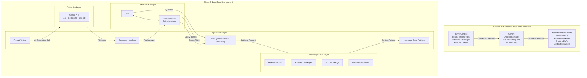

# SunnyTrips — RAG Pipeline · Simple B (Exact Clone, Relabeled)

> **Paste-ready, 1:1 clone of [Image 1] — only labels updated to live schema.**  
> For thesis main figure. Detailed 13-intent version stays as `rag_pipeline.png` / `rag_pipeline.md` appendix.

PNG: `rag_pipeline_simple_B.png` (styled) · Source HTML: `public/rag_pipeline_simple_B.html`

**What changed vs [Image 1]:** `Travel Content: Guides/FAQs/Packages/Reviews` → `Hotels/RoomTypes/Activities/Packages/AddOns/FAQs` · `Knowledge Base: Guides/FAQs/Manuals/Reviews` → `Hotels/Rooms · Activities/Packages · AddOns/FAQs · Destinations/Users` · `AI Service` stays `Gemini 2.5 Flash-lite` (+ tiny `text-embedding-001` subline). Same boxes, same arrows.

---

## Mermaid — copy from ```mermaid to ```



## draw.io XML — File → Import From → Device

```xml
<mxfile host="app.diagrams.net"><diagram name="Simple B"><mxGraphModel><root><mxCell id="0"/><mxCell id="1" parent="0"/>
<mxCell id="ph1" value="Phase 1: Background Setup (Data Indexing)" style="swimlane;fillColor=#0a78a8;fontColor=#ffffff;fontStyle=1;" vertex="1" parent="1"><mxGeometry x="20" y="20" width="1080" height="120" as="geometry"/></mxCell>
<mxCell id="t" value="Travel Content&#xa;Hotels · RoomTypes&#xa;Activities · Packages&#xa;AddOns · FAQs" style="rounded=1;fillColor=#ffffff;strokeColor=#0a78a8;" vertex="1" parent="ph1"><mxGeometry x="20" y="30" width="240" height="70" as="geometry"/></mxCell>
<mxCell id="g" value="Gemini&#xa;Embedding Model&#xa;text-embedding-001" style="rounded=1;fillColor=#f0f9ff;strokeColor=#0a78a8;" vertex="1" parent="ph1"><mxGeometry x="420" y="30" width="240" height="70" as="geometry"/></mxCell>
<mxCell id="k" value="Knowledge Base Layer&#xa;Hotels/Rooms&#xa;Activities/Packages&#xa;AddOns/FAQs&#xa;Destinations/Users" style="shape=cylinder3;fillColor=#e0f2fe;strokeColor=#0a78a8;" vertex="1" parent="ph1"><mxGeometry x="820" y="20" width="180" height="90" as="geometry"/></mxCell>
<mxCell id="ph2" value="Phase 2: Real-Time User Interaction" style="swimlane;fillColor=#0a78a8;fontColor=#ffffff;fontStyle=1;" vertex="1" parent="1"><mxGeometry x="20" y="160" width="1080" height="360" as="geometry"/></mxCell>
<mxCell id="ui" value="User Interface Layer&#xa;User &lt;—&gt; Chat Interface" style="rounded=1;fillColor=#ffffff;strokeColor=#0a78a8;" vertex="1" parent="ph2"><mxGeometry x="20" y="30" width="180" height="300" as="geometry"/></mxCell>
<mxCell id="app" value="Application Layer&#xa;User Query Entry and Processing&#xa;Knowledge Base Retrieval&#xa;Prompt Writing&#xa;Response Handling" style="rounded=1;fillColor=#ffffff;strokeColor=#0a78a8;" vertex="1" parent="ph2"><mxGeometry x="230" y="30" width="500" height="300" as="geometry"/></mxCell>
<mxCell id="kb" value="Knowledge Base Layer" style="shape=cylinder3;fillColor=#e0f2fe;strokeColor=#0a78a8;" vertex="1" parent="ph2"><mxGeometry x="760" y="30" width="150" height="180" as="geometry"/></mxCell>
<mxCell id="ai" value="AI Service Layer&#xa;Gemini API&#xa;Gemini 2.5 Flash-lite" style="ellipse;fillColor=#fdf1ec;strokeColor=#e85e37;" vertex="1" parent="ph2"><mxGeometry x="760" y="230" width="150" height="100" as="geometry"/></mxCell>
</root></mxGraphModel></diagram></mxfile>
```
